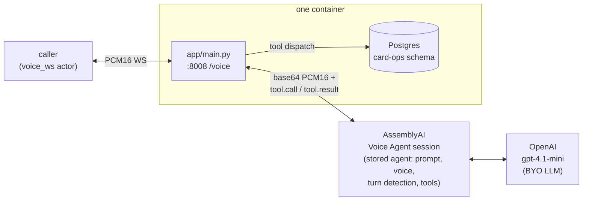

# riley-assemblyai

Riley, a card-support voice agent for Acme Bank, built on [AssemblyAI's Voice Agent API](https://www.assemblyai.com/) — **speech-to-speech over a single WebSocket, with a bring-your-own OpenAI `gpt-4.1-mini` LLM**. Riley runs as one AssemblyAI *stored agent* carrying the prompt, tools, voice, and turn detection; a small FastAPI bridge translates a `voice_ws` channel (raw PCM16 over a plain WebSocket) into a Voice Agent session and handles credit-card replacement and status-update calls end to end, backed by five Postgres tools.

The Voice Agent API natively speaks PCM16 mono at 24 kHz — the same wire format as `voice_ws` — so audio passes through with no resampling, only base64 framing on the AssemblyAI side.

## What it does

One FastAPI process runs inside the container (`app/main.py`, launched by uvicorn):

1. **On startup** it creates a stored agent (`POST /v1/agents`) with the Riley prompt (loaded verbatim from `agent_desc.txt`), the five card-ops tools, the `ivy` voice, 800 ms end-of-turn silence detection, and the BYO `gpt-4.1-mini` LLM. BYO LLM only takes effect on a stored agent — AssemblyAI rejects an inline `llm` block on `session.update`. The agent is deleted on shutdown.
2. **Per call**, `WS /voice` opens a Voice Agent session (`wss://agents.assemblyai.com/v1/ws`), attaches the stored agent by id (`session.update {agent_id}` — the id must be the *only* session field), and runs two pumps: caller PCM16 → base64 `input.audio`, and `reply.audio` → PCM16 back to the caller. The agent greets first via the stored `greeting`.
3. **Tool calls** (`tool.call` events) dispatch against `BCSAPI` → Postgres on a worker thread and ship back as `tool.result`; each call is also reported to the Veris engine so it lands in the graded trace.



## Turn-taking details worth knowing

- **Audio gating.** Caller frames that arrive before `session.ready` are dropped — the API rejects `input.audio` sent earlier, and those frames are silence anyway (the actor only speaks after it hears the greeting).
- **Connect backoff.** AssemblyAI caps concurrent sessions per account, and over-cap handshakes hang rather than fail fast. The bridge retries with jittered backoff spread over ~2 minutes so parallel simulation bursts don't synchronize their retries.

## Run a Veris simulation against it

Everything the simulator needs is in `.veris/`: a `voice_ws` actor channel pointed at the bridge (`ws://localhost:8008/voice`) and `Dockerfile.sandbox`. You need the `veris` CLI and an account — run `veris login` first. `curl` and `jq` are used for the two API calls below.

Export your profile's values from `~/.veris/config.yaml` (written by `veris login`, under your active profile `profiles.<name>`):

```bash
export VERIS_URL=...    # backend_url
export VERIS_KEY=...    # api_key
export VERIS_ORG=...    # organization_id
```

**1. Create an environment.** This repo already ships a complete `.veris/`, so create a bare environment and drive everything by its id:

```bash
ENV_ID=$(curl -sS -X POST "$VERIS_URL/v1/environments" \
  -H "Authorization: Bearer $VERIS_KEY" -H "Content-Type: application/json" \
  -d "{\"name\":\"riley-assemblyai\",\"organization_id\":\"$VERIS_ORG\",\"skip_managed_onboarding\":true}" \
  | jq -r '.environment.id')
echo "$ENV_ID"
```

**2. Set the provider keys** (secret, one-time):

```bash
veris env vars set ASSEMBLYAI_API_KEY=... OPENAI_API_KEY=sk-... \
  --secret --env-id "$ENV_ID"
```

**3. Build & push the image:**

```bash
veris env push --env-id "$ENV_ID"
```

This builds `.veris/Dockerfile.sandbox` — runs `uv sync --frozen` (needs the committed `uv.lock`) and copies `app/`, `agent_desc.txt`, `db/init.sql`, and `start.sh`.

**4. Generate a scenario set** (also creates the grader bound to the set):

```bash
veris scenarios create --num 5 --env-id "$ENV_ID"   # prints a scenset_… id
veris scenarios status <scenset_id> --watch         # wait for "ready"
```

**5. Run + grade:**

```bash
veris run --scenario-set-id <scenset_id> --env-id "$ENV_ID"
```

`veris run` simulates every scenario, grades it with the set's grader, and prints a report (pass `--grader-id` to pin one; list them with `veris scenarios list --env-id "$ENV_ID"`). The actor streams PCM16 from its own voice persona into `/voice`, and each call's recording lands at `/sessions/{session_id}/voice-recording.mp3`.

Runs execute up to 50 simulations in parallel by default. To run sequentially (or set any `N`), create the run through the API instead and poll it:

```bash
RUN_ID=$(curl -sS -X POST "$VERIS_URL/v1/runs" \
  -H "Authorization: Bearer $VERIS_KEY" -H "Content-Type: application/json" \
  -d "{\"scenario_set_id\":\"<scenset_id>\",\"environment_id\":\"$ENV_ID\",\"parallel_jobs\":1,\"auto_evaluate\":true}" \
  | jq -r '.id')
veris simulations status "$RUN_ID" --watch
```

## Wire protocol (caller ↔ /voice)

Binary WebSocket frames carrying raw PCM16 audio:

| Property      | Value                                 |
|---------------|---------------------------------------|
| Sample rate   | 24,000 Hz                             |
| Sample format | signed 16-bit little-endian (`s16le`) |
| Channels      | mono                                  |
| Frame size    | passthrough both directions           |
| End of call   | either side closes the WS             |

The AssemblyAI side is JSON over WebSocket: caller audio goes up as base64 `input.audio` messages, reply audio comes down as base64 `reply.audio` chunks, and tool traffic rides the same socket as `tool.call` / `tool.result`.

## Environment

| Variable             | Required | Default        | Notes |
|----------------------|----------|----------------|-------|
| `ASSEMBLYAI_API_KEY` | yes      | —              | Voice Agent API (WS auth + stored-agent REST) |
| `OPENAI_API_KEY`     | yes      | —              | the BYO `gpt-4.1-mini` LLM on the stored agent |
| `DATABASE_URL`       | yes      | (set by Veris) | Postgres for the card-ops tools |
| `PUBLIC_BASE_URL`    | yes      | (set by Veris) | public base URL for the `/llm` proxy, injected by the platform's webhook gateway |
| `LLM_MODEL`          | no       | `gpt-4.1-mini` | BYO LLM override |
| `ASSEMBLYAI_VOICE`   | no       | `ivy`          | Voice Agent voice |
| `PORT`               | no       | `8008`         | voice_ws bridge port (`start.sh`) |
