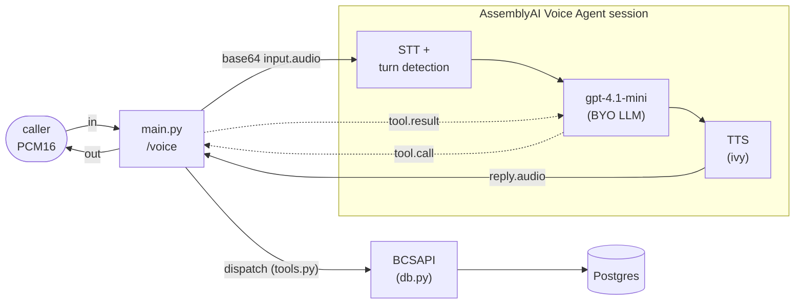

# app

The Python package for Riley. Four modules: the FastAPI bridge that *is* the
process (stored-agent lifecycle + the `voice_ws` ↔ Voice Agent session pumps),
the tool schemas and dispatcher, the Postgres-backed card-ops layer the tools
call, and a small Veris reporting shim. The session topology, turn-taking
details, and how to run a simulation live in the
[top-level README](../README.md); this doc is about the code.

| Module | Role |
|--------|------|
| `main.py` | The whole runtime. Creates/deletes the AssemblyAI stored agent (prompt from `agent_desc.txt`, tools, voice, turn detection, BYO `gpt-4.1-mini`) around the app's lifespan, exposes `WS /voice` (and `/health`), and runs the two audio pumps plus the `tool.call` handler for each session. |
| `tools.py` | The five card-ops tool schemas (AssemblyAI wire format) and `dispatch()`, which maps a `tool.call` event to the matching `BCSAPI` method. |
| `reporting.py` | Veris integration shim. `report_tool_call` fire-and-forgets each tool call to the sandbox engine so it lands in the graded trace; a no-op outside a simulation. |
| `db.py` | The card-ops schema (pydantic models + enums), a psycopg2 `Database` wrapper, and `BCSAPI`, the validated facade the tools go through. See also [`db/README.md`](../db/README.md) for the data itself. |

`__init__.py` is empty — this is a plain namespace package, run as a module
(`uvicorn app.main:app`).

## How one call flows through the package

1. A caller opens `WS /voice`. `main.py` connects to
   `wss://agents.assemblyai.com/v1/ws` (jittered-backoff retry — see the
   top-level README) and sends `session.update {agent_id}` to attach the stored
   agent. The agent id must be the *only* session field; everything else lives
   on the stored agent.
2. Once `session.ready` arrives, caller PCM16 flows up as base64 `input.audio`
   (earlier frames are dropped — the API rejects them and they're silence).
   AssemblyAI runs STT, turn detection, the BYO LLM, and TTS server-side.
3. A `tool.call` event lands in the bridge → `dispatch()` (`tools.py`) →
   `BCSAPI` (validation) → `Database` (SQL) → Postgres, on a worker thread so
   the pumps stay live. The result ships back as `tool.result` (a JSON string)
   and is reported to the Veris engine.
4. Reply audio streams down as `reply.audio` chunks and passes straight through
   to the caller.

## The five tools

Each entry in `tools.py`'s `TOOLS` is a thin wrapper over one `BCSAPI` method:

| Tool | `BCSAPI` method | Notes |
|------|-----------------|-------|
| `display_user_info` | `get_user_info` | read-only lookup |
| `display_card_info_by_last4` | `find_card_by_last4` | read-only; attaches any in-flight replacement |
| `change_card_status` | `update_card_status` | a cancelled card can't be changed |
| `request_card_replacement` | `request_card_replacement` | cancels the old card, issues a new one, records a `replacement` row |
| `update_card_replacement_status` | `update_card_replacement_status` | advances requested → mailed → delivered |

Business rules live in `BCSAPI`, not the tools: cancelled cards can't be
re-statused or replaced. A rejected call raises `ValueError` in the facade;
`main.py` catches it and returns `{"error": ...}` as the tool result so the
LLM sees the reason.

## Design notes worth knowing before you edit

- **BYO LLM requires a stored agent.** AssemblyAI rejects an inline `llm` block
  on `session.update` — the model is set at `POST /v1/agents` time and the WS
  just attaches by id. The create schema is undocumented, so startup round-trips
  a GET and warns loudly if `llm` or `input.turn_detection` didn't survive.
- **Tools report themselves to the Veris engine.** Voice Agent tools run
  in-process in this bridge and never reach the actor transcript, so the grader
  can't see them. `report_tool_call` (in `reporting.py`) fire-and-forgets an
  `agent_tool_call` event to `ENGINE_URL` so completed actions land in the
  graded trace. It no-ops when `SIMULATION_ID` is unset, and runs the blocking
  POST in a worker thread so it never stalls the realtime loop.
- **Tool dispatch is `sync`, run via `asyncio.to_thread`.** psycopg2 is
  synchronous; running it on the loop would freeze both audio pumps for its
  duration. Don't make `db.py` async without a reason.
- **Endpointing is AssemblyAI-native, pinned to 800 ms.** `TURN_DETECTION` sets
  `min_silence: 800` (with a 4000 ms hard cap) on the stored agent — the
  VAD/endpointer model itself is AssemblyAI's own and can't be swapped.
- **Clean teardown sends `session.end`.** Without it the server keeps the
  session resumable (and billable) for 30 seconds.

## Configuration

Provider knobs are read from the environment in `main.py`
(`ASSEMBLYAI_API_KEY`, `OPENAI_API_KEY`, `LLM_MODEL`, `ASSEMBLYAI_VOICE`);
`db.py` reads `DATABASE_URL`; `reporting.py` reads `ENGINE_URL` and
`SIMULATION_ID`. The full table with defaults is in the
[top-level README](../README.md#environment).
