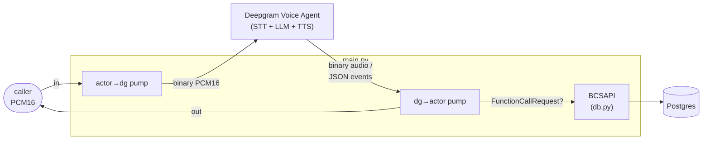

# app

The Python package for Riley. Four modules: the FastAPI bridge that *is* the
agent process, the Voice Agent function schemas + dispatcher, the
Postgres-backed card-ops layer the tools call, and a small Veris reporting
shim. Container startup and how to run a simulation live in the
[top-level README](../README.md); this doc is about the code.

| Module | Role |
|--------|------|
| `main.py` | The whole agent process. A FastAPI app exposing `WS /voice` (and `/health`); each connection opens its own Deepgram Voice Agent session, sends one `Settings` message (prompt from `agent_desc.txt`, the five functions, providers, audio format, greeting), and runs two pumps — caller audio → Deepgram, Deepgram messages → caller audio + function dispatch. |
| `tools.py` | Function schemas for `Settings.agent.think.functions`, and `dispatch()`, which maps a function call to the corresponding `BCSAPI` method. |
| `reporting.py` | Veris integration shim. `report_tool_call` fire-and-forgets each tool call to the sandbox engine so it lands in the graded trace; a no-op outside a simulation. |
| `db.py` | The card-ops schema (pydantic models + enums), a psycopg2 `Database` wrapper, and `BCSAPI`, the validated facade the tools go through. See also [`db/README.md`](../db/README.md) for the data itself. |

`__init__.py` is empty — this is a plain namespace package, run as
`uvicorn app.main:app`.

## How one call flows through the package

1. A caller opens `WS /voice`. `main.py` connects to
   `wss://agent.deepgram.com/v1/agent/converse` and sends `Settings`.
2. Deepgram answers `Welcome`, then `SettingsApplied`, which releases the
   audio gate; the caller's 20 ms PCM16 frames go straight onto the socket as
   binary. Deepgram's own turn detection decides when a turn ends.
3. A `FunctionCallRequest` is dispatched through `tools.py` → `BCSAPI`
   (validation) → `Database` (SQL) → Postgres; the result goes back as a
   `FunctionCallResponse` and Deepgram continues the turn itself.
4. TTS audio streams back to the caller chunk-by-chunk.

## The five tools

Each entry in `TOOLS` maps through `dispatch()` to one `BCSAPI` method:

| Tool | `BCSAPI` method | Notes |
|------|-----------------|-------|
| `display_user_info` | `get_user_info` | read-only lookup |
| `display_card_info_by_last4` | `find_card_by_last4` | read-only; attaches any in-flight replacement |
| `change_card_status` | `update_card_status` | a cancelled card can't be changed |
| `request_card_replacement` | `request_card_replacement` | cancels the old card, issues a new one, records a `replacement` row |
| `update_card_replacement_status` | `update_card_replacement_status` | advances requested → mailed → delivered |

Business rules live in `BCSAPI`, not the tools: cancelled cards can't be
re-statused or replaced. A rejected call raises `ValueError`, which `main.py`
catches and returns to the model as `{"error": ...}` so the LLM sees the
reason.

## Design notes worth knowing before you edit

- **The socket is mixed binary and text.** Binary frames are TTS audio and are
  forwarded to the caller as-is; text frames are the JSON event stream. The
  `dg→actor` pump branches on `isinstance(raw, bytes)` before parsing.
  Deepgram takes caller audio the same way — raw binary, no envelope, no
  base64 — so with both legs at PCM16/24 kHz and `container: "none"` this
  bridge never touches a sample.
- **A function is client-side because it has no `endpoint`.** Omitting
  `endpoint` from a `think.functions` entry is the whole mechanism. Deepgram
  also emits `FunctionCallRequest` for server-side functions as an
  *informational* event with `client_side: false`; answering one would be
  wrong, so `_handle_function_calls` skips those. One request can carry
  several calls, and each gets its own `FunctionCallResponse` keyed by `id`.
- **Tools report themselves to the Veris engine.** The Voice Agent session
  runs the LLM in Deepgram's cloud and executes the tools in-process here, so
  tool calls never reach the actor transcript and the grader can't see them.
  `report_tool_call` (in `reporting.py`) fire-and-forgets an `agent_tool_call`
  event to `ENGINE_URL` — on success *and* error paths — so completed actions
  land in the graded trace. It no-ops when `SIMULATION_ID` is unset, and runs
  the blocking POST in a worker thread so it never stalls the realtime loop.
- **Audio is gated on `SettingsApplied`.** Frames the actor sends before then
  are dropped, not buffered: they are the silence before Riley's greeting, and
  audio sent ahead of the server applying `Settings` is discarded anyway.
- **Tool calls don't need a nudge to resume the turn.** Unlike the OpenAI
  Realtime-shaped siblings, which must send a follow-up `response.create`
  after a tool result, Deepgram continues speaking on its own once the
  `FunctionCallResponse` lands.
- **`dispatch()` is sync and so is `BCSAPI`.** psycopg2 is synchronous, so the
  call runs in a worker thread (`asyncio.to_thread`) — otherwise a slow query
  freezes both audio pumps and collides with the actor's turn. Don't make
  `db.py` async without a reason.
- **Turn-taking is not configurable here.** The `v1` listen provider exposes
  no endpointing knob through `Settings`, so the 800 ms end-of-turn silence
  the cascaded Riley agents pin has no equivalent — Deepgram's built-in
  turn detection decides. Worth knowing before comparing latency numbers
  against the other implementations.

## Configuration

`main.py` reads `DEEPGRAM_API_KEY`, `DEEPGRAM_LISTEN_MODEL`, `DEEPGRAM_VOICE`,
and `LLM_MODEL`; `db.py` reads `DATABASE_URL`; `reporting.py` reads
`ENGINE_URL` and `SIMULATION_ID`. The full table with defaults is in the
[top-level README](../README.md#environment).
