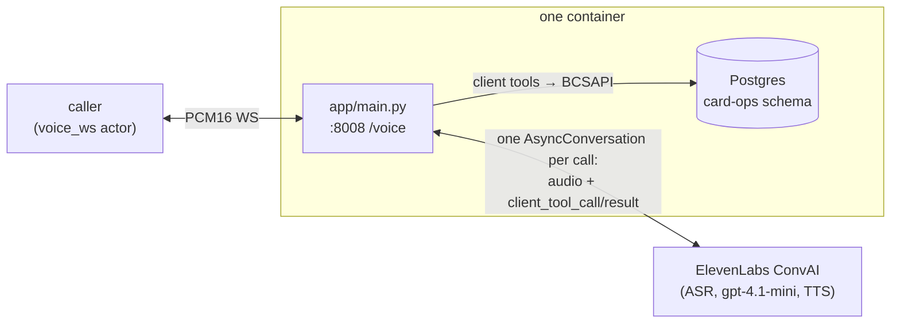

# Building a voice agent on ElevenLabs Conversational AI

## When to use this

- Working anywhere in `riley-agent/elevenlabs/`.
- Bridging ElevenLabs ConvAI into a Veris `voice_ws` channel.
- A client tool runs but the grader says the agent fabricated the action.
- The conversation closes mid-turn with `1008 policy violation`.
- Preparing an ElevenLabs submission for VAmoS Bench.

Not for: the ElevenLabs TTS API on its own (this is the full conversational
platform), or cascaded stacks that merely use ElevenLabs for TTS — those are the
`pipecat`, `livekit`, `vapi`, `retell` and `hermes` implementations.

## Architecture in one paragraph

ElevenLabs ConvAI is a **fully hosted runtime**: ASR (Scribe), the LLM
(`gpt-4.1-mini` by default), TTS (`eleven_flash_v2`) and turn-taking all run on
ElevenLabs' side. What you run is a single FastAPI process that exposes
`WS /voice` (raw PCM16), opens one `AsyncConversation` per call, registers the
five card-ops tools as **client tools**, and pumps audio in both directions.
Because client tools round-trip over your own *outbound* WebSocket to
`wss://api.elevenlabs.io`, there is no inbound tunnel and no public webhook —
unlike Vapi/Retell-style server tools, everything stays inside the container.
There is also no `OPENAI_API_KEY`: the LLM is billed and executed through
ElevenLabs.



## Prerequisites and credentials

| Variable | Required | Default | Notes |
|---|---|---|---|
| `ELEVENLABS_API_KEY` | yes | — | covers LLM, ASR and TTS — they all bill through ConvAI |
| `AGENT_ID` | no | created lazily | **pin this.** See "agent provisioning" below |
| `ELEVENLABS_VOICE_ID` | no | `EXAVITQu4vr4xnSDxMaL` (Sarah) | creation-time only |
| `ELEVENLABS_LLM` | no | `gpt-4.1-mini` | creation-time only |
| `ELEVENLABS_TTS_MODEL` | no | `eleven_flash_v2` | creation-time only; English ConvAI agents **reject** v2_5/v3 variants |
| `DATABASE_URL` | yes | set by Veris | Postgres for the card-ops tools |
| `PORT` | no | `8008` | `start.sh` only; `veris.yaml` pins 8008 |

Also needed: `uv`, the `veris` CLI (`veris login`), `curl`, `jq`. ConvAI usage is
billed per conversation credit — a 100-scenario run is real money (~688 credits
per call on the benchmark scenarios).

## The channel contract

Binary WebSocket frames, raw PCM16:

| Property | Value |
|---|---|
| Sample rate | 24,000 Hz (`pcm_24000` on both ElevenLabs legs) |
| Format | signed 16-bit little-endian (`s16le`) |
| Channels | mono |
| Framing | passthrough both ways — no resampling, no reframing |
| End of call | either side closes the WS |

24 kHz mono has to hold on **both** directions and on both ElevenLabs legs. A
mismatch does not error; it produces audio that is fast, slow, or noise.

A text frame on `/voice` is a protocol error — Starlette surfaces it as
`KeyError('bytes')`. That is an actor-side mismatch, not a bug in the handler.

## Wiring the five card-ops tools

Tool *schemas* live on the ElevenLabs platform (`conversation_config.agent.prompt.tools`,
each `type: "client"`); tool *implementations* run in this process. Register one
sync handler per tool on a `ClientTools` instance — the SDK runs sync handlers in
a thread pool, so blocking `psycopg2` is fine.

The five tools, each a thin schema over one `BCSAPI` method:

| Tool | `BCSAPI` method | Notes |
|---|---|---|
| `display_user_info` | `get_user_info` | read-only |
| `display_card_info_by_last4` | `find_card_by_last4` | read-only; attaches any in-flight replacement |
| `change_card_status` | `update_card_status` | a cancelled card cannot be changed |
| `request_card_replacement` | `request_card_replacement` | cancels the old card, issues a new one |
| `update_card_replacement_status` | `update_card_replacement_status` | requested → mailed → delivered |

Business rules live in `BCSAPI`, not in the tools. A rejected call raises
`ValueError` in the facade; the handler catches it and returns
`{"error": str(exc)}` so the model sees the reason.

Each handler must strip the `tool_call_id` ElevenLabs injects into `parameters`
before dispatching.

### The result must be a JSON string

```python
return json.dumps(result, default=str)
```

`client_tool_result.result` is a *string* field on the wire. Returning the dict
directly makes the orchestrator reject the frame and close with
`1008 policy violation`. `default=str` covers the enums and datetimes in the card
models. **This is the most common mistake in this integration**, and its symptom —
a call dropping mid-turn — points nowhere near its cause.

## Reporting tool calls to Veris — the #1 thing people get wrong

Client tools execute in-process and round-trip over your outbound conversation
socket. **They never reach the actor transcript.** Without explicit reporting the
grader cannot see them, and it will flag real, completed actions as fabricated —
scoring you down for work the agent actually did.

```python
report_tool_call(name, args, result)   # app/reporting.py
```

It POSTs an `agent_tool_call` event to `ENGINE_URL/simulations/$SIMULATION_ID/events`
and no-ops when `SIMULATION_ID` is unset. Because the SDK runs handlers off the
event loop, the blocking POST is safe inline — it can only delay that tool's own
response, never the audio path.

**Report error results too.** A tool that correctly refused an operation is
evidence of good behavior. If the grader cannot see the refusal, it sees only an
agent making a claim.

## Agent provisioning

`ensure_agent` reuses `AGENT_ID` if set; otherwise it creates a stored agent on
the platform with `agent_desc.txt` verbatim as the prompt, temperature 0.3,
`pcm_24000` both directions, a `first_message`, `ignore_default_personality: true`,
and `turn_eagerness: normal`.

Provisioning is **lazy** — it runs on the first `/voice` call, not at startup, so
the server answers `/health` without an API key.

Two consequences worth internalizing:

1. **Without `AGENT_ID`, every fresh process creates a new stored agent.** Across a
   100-scenario run that is a lot of agents on your account. Pin the id logged by
   the first call.
2. **`ELEVENLABS_LLM`, `ELEVENLABS_VOICE_ID` and `ELEVENLABS_TTS_MODEL` only apply at
   creation time.** A pinned agent keeps its stored platform config; changing the
   env var does nothing. Unset `AGENT_ID` to reprovision, or change it on the
   platform.

## Turn-taking

There is no silence-milliseconds knob — ElevenLabs uses a learned turn model. The
only exposed control is `turn_eagerness` (`normal` in the reference implementation,
kept explicit for reproducibility). `turn_timeout` is a re-prompt/inactivity timer,
**not** the per-utterance endpoint; lowering it to chase latency makes the agent
interrupt itself.

`interrupt()` in the audio interface is a logging no-op — nothing is buffered
locally, so barge-in behavior you observe is the platform's.

When comparing against cascaded stacks, note that they pin end-of-turn detection
explicitly and this one cannot. Any turn-taking conclusion here includes
ElevenLabs' own model.

## Running one simulation

```bash
uv sync && export ELEVENLABS_API_KEY=sk_... DATABASE_URL=postgresql://... && ./start.sh
curl localhost:8008/health

veris login
export VERIS_URL=... VERIS_KEY=... VERIS_ORG=...    # from ~/.veris/config.yaml

ENV_ID=$(curl -sS -X POST "$VERIS_URL/v1/environments" \
  -H "Authorization: Bearer $VERIS_KEY" -H "Content-Type: application/json" \
  -d "{\"name\":\"riley-elevenlabs\",\"organization_id\":\"$VERIS_ORG\",\"skip_managed_onboarding\":true}" \
  | jq -r '.environment.id')

veris env vars set ELEVENLABS_API_KEY=sk_... --secret --env-id "$ENV_ID"
veris env vars set AGENT_ID=agent_...        --env-id "$ENV_ID"
veris env push --env-id "$ENV_ID"

veris scenarios create --num 5 --env-id "$ENV_ID"
veris scenarios status <scenset_id> --watch

RUN_ID=$(curl -sS -X POST "$VERIS_URL/v1/runs" \
  -H "Authorization: Bearer $VERIS_KEY" -H "Content-Type: application/json" \
  -d "{\"scenario_set_id\":\"<scenset_id>\",\"environment_id\":\"$ENV_ID\",\"parallel_jobs\":1,\"auto_evaluate\":true}" \
  | jq -r '.id')
veris simulations status "$RUN_ID" --watch
```

Recordings land at `/sessions/{session_id}/voice-recording.mp3`.

## Submitting a row to VAmoS Bench

A row needs: an independently runnable implementation with a committed `uv.lock`,
a complete `.veris/` (channel + Dockerfile.sandbox + entry_point), Riley's prompt
unmodified, all five tools reporting to the engine, and synthetic data only. Then
open a PR against `veris-ai/riley-agent` and get in touch — the benchmark runs the
same 100 scenarios and publishes the result either way.

## Sharp edges

| Symptom | Cause | Fix |
|---|---|---|
| Call drops mid-turn, `1008 policy violation` | Handler returned a dict | `json.dumps(result, default=str)` |
| Grader says the agent fabricated a completed action | Client tools never reach the actor transcript | `report_tool_call(...)` on every path, including errors |
| Model claims success after a failed operation | Exception swallowed instead of returned | Catch and return `{"error": str(exc)}` |
| TTS model rejected at agent creation | English ConvAI agents reject `eleven_flash_v2_5` / v3 | Use `eleven_flash_v2` |
| Changed `ELEVENLABS_LLM`/voice/TTS, nothing changed | Creation-time only | Unset `AGENT_ID` to reprovision, or edit on the platform |
| A new stored agent appears on every boot | `AGENT_ID` unset | Pin the id logged by the first call |
| `KeyError('bytes')` on `/voice` | Actor sent a text frame on a binary channel | Actor-side protocol mismatch, not your handler |
| Audio fast / slow / noise | Sample-rate mismatch | 24 kHz mono PCM16 on both directions and both ElevenLabs legs |
| Conversation deadlocks after a turn | Actor VAD never sees end-of-speech | Pad each turn with trailing silence (~1700 ms of PCM16) |
| `uv sync --frozen` fails in the sandbox build | `uv.lock` not committed | The lockfile is a build input for `Dockerfile.sandbox` |
| `veris run` aborts: "No grader found" | CLI ≤ 2.27.1 silently skips grader generation | `POST /v1/scenario-sets/<id>/regenerate` with `{"from_step":"graders"}`, then re-watch |
| Server boots fine but first call fails on auth | Provisioning is lazy — `/health` never touches the API | Check `ELEVENLABS_API_KEY` reached the container |

## What this stack scored

67.3% ±0.9 pp task completion on VAmoS Bench (5th of 17, and the **tightest error
bar in the field**), **1.19 s median response latency — fastest of all 17**,
$0.114/call in vendor-billed credits, 99.7% connect. By group: 68.9% simple,
57.9% complex, 77.1% adversarial.

Two published failure patterns worth reading before you write your own prompt:
confirming a delivery-address change that never reached the database, and telling
a caller who failed verification *which* field was wrong. The second one matters
architecturally — a per-factor rejection lets an attacker iterate credentials.

## Reference files — do not re-derive

| Path | What |
|---|---|
| `riley-agent/elevenlabs/README.md` | run instructions, wire protocol, env table |
| `riley-agent/elevenlabs/app/README.md` | module map, audio bridge, client-tool round-trip, design notes |
| `riley-agent/elevenlabs/app/main.py` | `WS /voice`, `WebSocketAudioInterface`, `_build_client_tools` |
| `riley-agent/elevenlabs/app/agent_setup.py` | `ensure_agent` and the full `conversation_config` |
| `riley-agent/elevenlabs/app/tools.py` | `TOOLS` schemas and `dispatch()` |
| `riley-agent/elevenlabs/app/reporting.py` | `report_tool_call` |
| `riley-agent/elevenlabs/db/init.sql` | card-ops schema and synthetic seed data |
| `riley-agent/elevenlabs/.veris/veris.yaml` | channel, postgres service, entry_point |
| `docs.veris.ai/reference/frameworks/elevenlabs` | the published integration guide |
