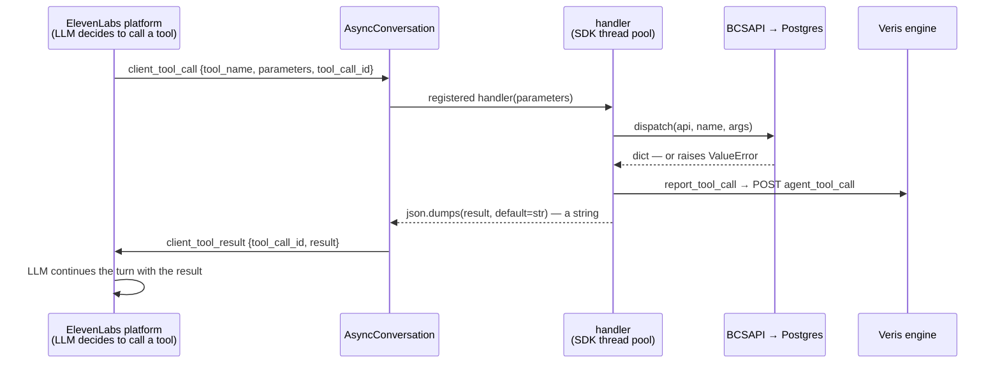

# app

The Python package for Riley. Five modules: the FastAPI app that bridges a
`voice_ws` caller into an ElevenLabs conversation, the provisioner for the
stored ElevenLabs agent, the client-tool schemas + dispatcher, the
Postgres-backed card-ops layer, and a small Veris reporting shim. Container
startup, the wire protocol, and how to run a simulation live in the
[top-level README](../README.md); this doc is about the code.

| Module | Role |
|--------|------|
| `main.py` | The FastAPI app: `WS /voice` (and `/health`). Per connection it resolves the stored agent, opens an `AsyncConversation`, registers the five client tools, and pumps audio through `WebSocketAudioInterface`. |
| `agent_setup.py` | `ensure_agent`: reuse `AGENT_ID` or create the stored ElevenLabs agent via `agents.create()` — `agent_desc.txt` verbatim as the prompt, `gpt-4.1-mini`, temperature 0.3, `eleven_flash_v2` + Sarah, `pcm_24000` both directions, `first_message`, `ignore_default_personality: true`, `turn_eagerness: normal`. |
| `tools.py` | `TOOLS` — the wire-format `type: "client"` entries for `conversation_config.agent.prompt.tools` — and `dispatch()`, which maps a tool name to the matching `BCSAPI` call and returns a JSON-able dict. |
| `db.py` | The card-ops schema (pydantic models + enums), a psycopg2 `Database` wrapper, and `BCSAPI`, the validated facade the tools go through. See also [`db/README.md`](../db/README.md) for the data itself. |
| `reporting.py` | Veris integration shim. `report_tool_call` POSTs each tool call to the sandbox engine so it lands in the graded trace; a no-op outside a simulation. |

`__init__.py` is empty — this is a plain namespace package, run as a module
(`uvicorn app.main:app`).

## The audio bridge

`WebSocketAudioInterface` (in `main.py`) subclasses the SDK's
`AsyncAudioInterface` and is pure passthrough — no resampling, no reframing:

- **Inbound:** `start()` hands us the SDK's `input_callback`; the `/voice`
  handler's `receive_bytes` loop calls `push_actor_audio`, which forwards each
  actor frame to that callback unchanged.
- **Outbound:** the SDK calls `output()` with each PCM16 chunk from
  ElevenLabs; we `send_bytes` it straight to the actor.
- **Barge-in:** `interrupt()` is a no-op beyond logging — nothing is buffered
  on our side, since chunks are forwarded as they arrive.

Both pumps log a heartbeat every `LOG_EVERY_N_FRAMES` (50) frames — roughly
once a second at 20 ms/frame — so `agent.log` alone shows whether audio flows.

## The client-tool round-trip

ElevenLabs "client tools" execute here, in this process: the platform sends a
`client_tool_call` down the same outbound conversation WebSocket, the SDK runs
the registered handler, and the result goes back up as `client_tool_result`.
No inbound tunnel, no webhook.

`_build_client_tools` registers one sync handler per tool on a `ClientTools`
instance; the SDK runs sync handlers in a thread pool, so blocking on psycopg2
is fine. Each handler strips the `tool_call_id` ElevenLabs injects into
`parameters` before dispatching. Exceptions from `dispatch` are caught and
turned into `{"error": str(exc)}` — the LLM sees the reason (e.g. "cannot
replace an already cancelled card") instead of the tool silently failing, and
the error is reported to Veris like any other result.

**The result must be a JSON string.** `client_tool_result.result` is a string
field on the wire; returning the dict directly makes the orchestrator reject
the frame with a `1008 policy violation` close. Hence
`json.dumps(result, default=str)` — `default=str` covers the enums and
datetimes in the card models.

## The five tools

Each `TOOLS` entry is a thin schema over one `BCSAPI` method, wired in
`dispatch()`:

| Tool | `BCSAPI` method | Notes |
|------|-----------------|-------|
| `display_user_info` | `get_user_info` | read-only lookup |
| `display_card_info_by_last4` | `find_card_by_last4` | read-only; attaches any in-flight replacement |
| `change_card_status` | `update_card_status` | a cancelled card can't be changed |
| `request_card_replacement` | `request_card_replacement` | cancels the old card, issues a new one, records a `replacement` row |
| `update_card_replacement_status` | `update_card_replacement_status` | advances requested → mailed → delivered |

Business rules live in `BCSAPI`, not the tools: cancelled cards can't be
re-statused or replaced. A rejected call raises `ValueError` in the facade,
which the handler returns (and reports) as an error result.

## Design notes worth knowing before you edit

- **Tools report themselves to the Veris engine.** Client tools run in-process
  and never reach the actor transcript, so the grader can't see them and may
  flag real, completed actions as fabricated. `report_tool_call`
  (in `reporting.py`) POSTs an `agent_tool_call` event to `ENGINE_URL` —
  including error results. It no-ops when `SIMULATION_ID` is unset. The SDK
  runs client-tool handlers in a worker thread — off the event loop — so the
  blocking POST is safe inline: it can only delay this tool's own response,
  never the audio path.
- **Agent provisioning is lazy.** `_startup` only builds the shared
  `ElevenLabs` client; `ensure_agent` runs on the first `/voice` call, so the
  server boots for `/health` checks without an API key. Without `AGENT_ID`,
  every fresh process creates a new stored agent — pin the logged id to reuse
  one.
- **Endpointing is ElevenLabs' learned turn model.** There is no silence-ms
  knob to pin; `turn_eagerness` is set to `normal` (the default) so runs are
  explicit and consistent. `turn_timeout` is a re-prompt/inactivity timer, not
  the per-utterance endpoint.
- **`conversation_config` is a plain dict.** Pydantic accepts dicts matching
  the nested schema and the SDK's `UncheckedBaseModel` ignores unknown fields,
  so `agent_setup.py` skips importing a dozen submodels.
- **`tools.py` handlers are sync, `BCSAPI` is sync.** psycopg2 is synchronous
  and the SDK already runs handlers off the loop. Don't make `db.py` async
  without a reason.

## Configuration

`main.py` reads `ELEVENLABS_API_KEY` and `AGENT_ID`; `agent_setup.py` reads
`AGENT_ID`, `ELEVENLABS_VOICE_ID`, `ELEVENLABS_LLM`, and
`ELEVENLABS_TTS_MODEL` (creation-time only); `db.py` reads `DATABASE_URL`;
`reporting.py` reads `ENGINE_URL` and `SIMULATION_ID`. The full table with
defaults is in the [top-level README](../README.md#environment).
