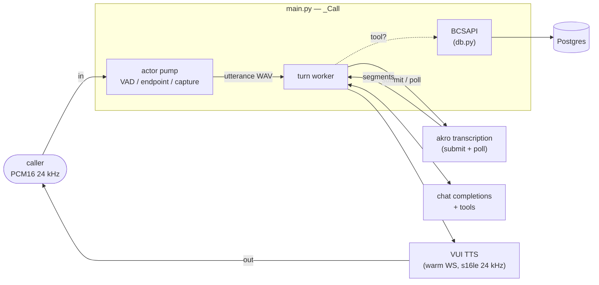

# app

The Python package for Riley. Four modules: the FastAPI app that *is* the
agent process and hosts the whole speech pipeline, the tool schemas +
dispatcher, the Postgres-backed card-ops layer the tools call, and a small
Veris reporting shim. Container startup and how to run a simulation live in the
[top-level README](../README.md); this doc is about the code.

| Module | Role |
|--------|------|
| `main.py` | The whole agent process. A FastAPI app exposing `WS /voice` (and `/health`); each connection runs the pipeline in `_Call` — VAD, endpointing, and turn capture on the caller's audio, per-turn akro batch transcription, an OpenAI-compatible chat completion with the five tools, and streaming VUI TTS for the reply over a warm WebSocket. |
| `tools.py` | The five card-ops tools in the OpenAI function-calling shape, and `dispatch()`, which maps a tool call to the corresponding `BCSAPI` method. |
| `reporting.py` | Veris integration shim. `report_tool_call` fire-and-forgets each tool call to the sandbox engine so it lands in the graded trace; a no-op outside a simulation. |
| `db.py` | The card-ops schema (pydantic models + enums), a psycopg2 `Database` wrapper, and `BCSAPI`, the validated facade the tools go through. See also [`db/README.md`](../db/README.md) for the data itself. |

`__init__.py` is empty — this is a plain namespace package, run as
`uvicorn app.main:app`.

## How one call flows through the package

1. A caller opens `WS /voice`. The turn worker speaks the greeting through VUI
   so Riley opens the call — which also opens the TTS socket that later
   replies reuse.
2. Every inbound 20 ms frame is measured (`audioop.rms`). The RMS is the VAD:
   it decides barge-in, what audio belongs to the utterance (plus a 0.4 s
   pre-roll so onset isn't clipped), and, after `END_OF_TURN_S` of silence *in
   audio time*, the endpoint.
3. At the endpoint the captured utterance is queued. The worker wraps it in a
   WAV, submits it to `/akro/submit`, and polls `/transcriptions/{id}` until
   the job completes; the turn text is the `segments` texts joined.
4. The worker appends the turn, calls chat completions with the five tools,
   and loops while the model keeps calling them: each call goes through
   `tools.dispatch` → `BCSAPI` (validation) → `Database` (SQL) → Postgres, and
   comes back as a `tool` message.
5. The final text is rendered by VUI over the warm WebSocket — binary s16le
   PCM at 24 kHz, already the wire format — and forwarded to the caller chunk
   by chunk. A voiced frame arriving mid-reply cancels that task — barge-in —
   and drops the TTS socket, since the server would otherwise keep pushing the
   dead render's frames at it.

Turns are queued and handled one at a time, so the message list is only ever
touched by the worker even when the caller talks over a reply.
