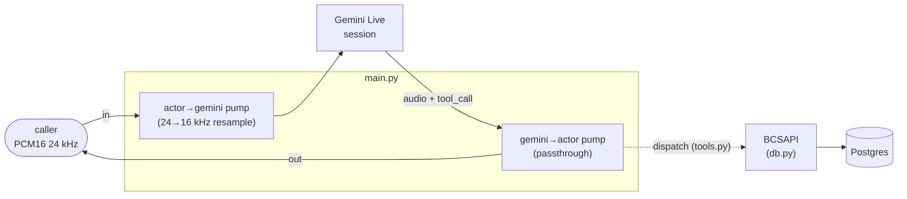

# app

The Python package for Riley. Four modules: the FastAPI bridge that *is* the
agent process, the tool schemas + dispatcher, the Postgres-backed card-ops
layer, and a small Veris reporting shim. The container startup and how to run
a simulation live in the [top-level README](../README.md); this doc is about
the code.

| Module | Role |
|--------|------|
| `main.py` | The whole agent process. A FastAPI app exposing `WS /voice` (and `/health`); each connection opens its own Gemini Live session (`agent_desc.txt` as system instruction, the five tools registered), runs two audio pumps, and dispatches tool calls. |
| `tools.py` | The five card-ops function declarations in Gemini's wire format (an OpenAPI-3.0 subset — no `{"type": "function"}` wrapper, no `additionalProperties`), plus `dispatch()`, which maps a Gemini `FunctionCall` to the matching `BCSAPI` method. |
| `reporting.py` | Veris integration shim. `report_tool_call` fire-and-forgets each tool call to the sandbox engine so it lands in the graded trace; a no-op outside a simulation. |
| `db.py` | The card-ops schema (pydantic models + enums), a psycopg2 `Database` wrapper, and `BCSAPI`, the validated facade the tools go through. See also [`db/README.md`](../db/README.md) for the data itself. |

`__init__.py` is empty — this is a plain namespace package, run as
`uvicorn app.main:app`.

## How one call flows through the package

1. A caller opens `WS /voice`. `main.py` connects a fresh Gemini Live session
   and sends a greeting trigger so Riley speaks first.
2. Two pumps run concurrently: `_pump_actor_to_gemini` resamples the caller's
   24 kHz frames to Gemini's required 16 kHz input; `_pump_gemini_to_actor`
   forwards Gemini's 24 kHz output straight back and re-enters
   `session.receive()` for each new turn (it returns after every complete model
   turn — without the outer loop the call would drop after the greeting).
3. A `tool_call` lands in the gemini→actor pump → `dispatch()` (`tools.py`) →
   `BCSAPI` (validation) → `Database` (SQL) → Postgres, and the result goes
   back to Gemini via `send_tool_response`; Gemini resumes the turn on its own.
4. On `turn_complete` with audio, the pump flushes ~1700 ms of PCM silence so
   the caller's VAD detects end-of-speech.

## The five tools

Each function declaration in `tools.py` maps through `dispatch()` to one
`BCSAPI` method:

| Tool | `BCSAPI` method | Notes |
|------|-----------------|-------|
| `display_user_info` | `get_user_info` | read-only lookup |
| `display_card_info_by_last4` | `find_card_by_last4` | read-only; attaches any in-flight replacement |
| `change_card_status` | `update_card_status` | a cancelled card can't be changed |
| `request_card_replacement` | `request_card_replacement` | cancels the old card, issues a new one, records a `replacement` row |
| `update_card_replacement_status` | `update_card_replacement_status` | advances requested → mailed → delivered |

Business rules live in `BCSAPI`, not the tools: cancelled cards can't be
re-statused or replaced. A rejected call raises `ValueError`, which `dispatch`'s
caller catches and returns to Gemini as `{"error": ...}` so the model sees the
reason.

## Design notes worth knowing before you edit

- **Tools report themselves to the Veris engine.** Gemini Live runs the LLM in
  Google's cloud and the tools execute in-process here, so tool calls never
  reach the actor transcript and the grader can't see them. `report_tool_call`
  (in `reporting.py`) fire-and-forgets an `agent_tool_call` event to
  `ENGINE_URL` — called on success *and* error paths. It no-ops when
  `SIMULATION_ID` is unset, and runs the blocking POST in a worker thread so it
  never stalls the realtime loop.
- **`session.receive()` yields one model turn, then returns.** The
  gemini→actor pump wraps it in an outer `while True` and re-enters it per
  turn; a bare `async for` would end the call after the opening greeting.
- **Gemini's VAD threshold is pinned** (`silence_duration_ms=800`,
  `prefix_padding_ms=300`) so end-of-turn behavior is explicit and comparable
  across the riley-* transports.
- **Only the input leg resamples.** Actor 24 kHz → Gemini 16 kHz via
  `audioop.ratecv` with carried state; Gemini's 24 kHz output matches the actor
  rate and passes through. `audioop` is stdlib but removed in Python 3.13 —
  hence `requires-python <3.13`.
- **Tool dispatch is `sync` inside an async pump.** psycopg2 is synchronous;
  tool calls are infrequent enough that briefly blocking the loop on a quick
  query is fine. Don't make `db.py` async without a reason.

## Configuration

Model and voice knobs are read from the environment in `main.py`
(`GEMINI_LIVE_MODEL`, `GEMINI_VOICE`, `GEMINI_API_KEY`); `db.py` reads
`DATABASE_URL`; `reporting.py` reads `ENGINE_URL` and `SIMULATION_ID`. The full
table with defaults is in the [top-level README](../README.md#environment).
