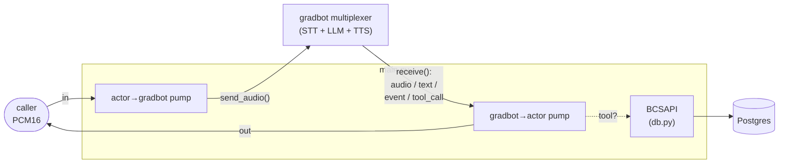

# app

The Python package for Riley. Four modules: the FastAPI bridge that *is* the
agent process, the gradbot tool definitions + dispatcher, the Postgres-backed
card-ops layer the tools call, and a small Veris reporting shim. Container
startup and how to run a simulation live in the
[top-level README](../README.md); this doc is about the code.

| Module | Role |
|--------|------|
| `main.py` | The whole agent process. A FastAPI app exposing `WS /voice` (and `/health`); each connection calls `gradbot.run()` to start its own session (instructions from `agent_desc.txt`, the five tools, a Gradium voice), then runs two pumps — caller audio → gradbot, gradbot messages → caller audio + tool dispatch. |
| `tools.py` | The five card-ops tools as `gradbot.ToolDef`s (name, description, JSON-Schema string), and `dispatch()`, which maps a gradbot tool call to the corresponding `BCSAPI` method. |
| `reporting.py` | Veris integration shim. `report_tool_call` fire-and-forgets each tool call to the sandbox engine so it lands in the graded trace; a no-op outside a simulation. |
| `db.py` | The card-ops schema (pydantic models + enums), a psycopg2 `Database` wrapper, and `BCSAPI`, the validated facade the tools go through. See also [`db/README.md`](../db/README.md) for the data itself. |

`__init__.py` is empty — this is a plain namespace package, run as
`uvicorn app.main:app`.

## How one call flows through the package

1. A caller opens `WS /voice`. `main.py` calls `gradbot.run()` with the
   session config (prompt, tools, voice, `assistant_speaks_first`) and PCM in
   and out. gradbot immediately sends the LLM `"[start]"`, which produces the
   greeting.
2. The caller's 20 ms PCM16 frames go straight to `input_handle.send_audio()`
   — no resampling, since the actor's 24 kHz is gradbot's PCM input rate.
3. The multiplexer decides when the turn ends: STT text goes quiet for 0.5 s,
   it flushes `flush_duration_s` of silence into the STT buffer, and the
   complete utterance goes to the LLM.
4. A `tool_call` message is dispatched through `tools.py` → `BCSAPI`
   (validation) → `Database` (SQL) → Postgres; the result goes back via
   `msg.tool_call_handle.send(json)` and gradbot resumes the turn on its own.
5. Reply audio arrives as `audio` messages at 48 kHz, is halved to 24 kHz, and
   streams to the caller chunk-by-chunk.

## The five tools

Each entry in `TOOLS` maps through `dispatch()` to one `BCSAPI` method:

| Tool | `BCSAPI` method | Notes |
|------|-----------------|-------|
| `display_user_info` | `get_user_info` | read-only lookup |
| `display_card_info_by_last4` | `find_card_by_last4` | read-only; attaches any in-flight replacement |
| `change_card_status` | `update_card_status` | a cancelled card can't be changed |
| `request_card_replacement` | `request_card_replacement` | cancels the old card, issues a new one, records a `replacement` row |
| `update_card_replacement_status` | `update_card_replacement_status` | advances requested → mailed → delivered |

Business rules live in `BCSAPI`, not the tools: cancelled cards can't be
re-statused or replaced. A rejected call raises `ValueError`, which
`_handle_tool_call` catches and returns to the model as `{"error": ...}` so the
LLM sees the reason.

gradbot adds a sixth tool of its own, `reset_asr`, to recover from a stuck
transcription stream. It handles that call inside the multiplexer and never
forwards it, so `dispatch()` only ever sees the five above.

## Design notes worth knowing before you edit

- **gradbot's system prompt wraps `agent_desc.txt`, it doesn't replace it.**
  The `instructions` you pass land in an `additional_instructions` slot inside
  gradbot's own scaffold, which already covers speech-conversation style,
  transcription errors, the `—` interruption marker, `PENDING` tool results,
  and the `"..."` silence signal. Riley's prompt only has to cover Riley.
- **The greeting needs an explicit override.** `assistant_speaks_first=True`
  makes gradbot send the LLM `"[start]"`, and its scaffold instructs the model
  to greet. The shared `agent_desc.txt` states the greeting already happened.
  `main.py` appends an "Opening line" section that says to disregard that note
  and pins the exact wording, so `agent_desc.txt` stays byte-identical to the
  other implementations.
- **Silence re-engagement is off.** `silence_timeout_s=0.0`. Left at gradbot's
  default of 5 s, a thinking caller gets prompted with `"..."` and hung up on
  after three, which no other Riley implementation does.
- **Output PCM is 48 kHz, input PCM is 24 kHz.** `AudioFormat.Pcm` is
  asymmetric in gradbot's Python bindings and neither rate is configurable, so
  the output pump halves every chunk with `audioop.ratecv`. The resampler state
  is carried across chunks — dropping it clicks at every chunk boundary.
- **Tools report themselves to the Veris engine.** Tool calls execute
  in-process and never reach the actor transcript, so the grader can't see
  them. `report_tool_call` (in `reporting.py`) fire-and-forgets an
  `agent_tool_call` event to `ENGINE_URL` — on success *and* error paths — so
  completed actions land in the graded trace. It no-ops when `SIMULATION_ID` is
  unset, and runs the blocking POST in a worker thread.
- **Audio chunks stream straight through.** Every `audio` message is
  resampled and forwarded as it arrives — no whole-turn buffering — so response
  latency reflects the model, not this harness. On barge-in gradbot simply
  stops emitting, so there's nothing to flush on this side.
- **`dispatch()` runs inline in the output pump.** `BCSAPI` is synchronous
  psycopg2 and every card-ops query is a single-row lookup or update, so the
  pump stalls a millisecond or two at most. gradbot's deferred-tool machinery
  (keep talking while a slow tool runs) is there if a tool ever needs it —
  return from `_handle_tool_call` without sending and call `send()` later.
- **`dispatch()` is `sync` and so is `BCSAPI`.** Don't make `db.py` async
  without a reason.

## Configuration

`main.py` reads `GRADBOT_VOICE_ID` and, via `gradbot.config.from_env()`,
`GRADIUM_API_KEY`, `LLM_API_KEY`, `LLM_MODEL`, `LLM_BASE_URL`, and
`GRADIUM_BASE_URL`; `db.py` reads `DATABASE_URL`; `reporting.py` reads
`ENGINE_URL` and `SIMULATION_ID`. The full table with defaults is in the
[top-level README](../README.md#environment).
