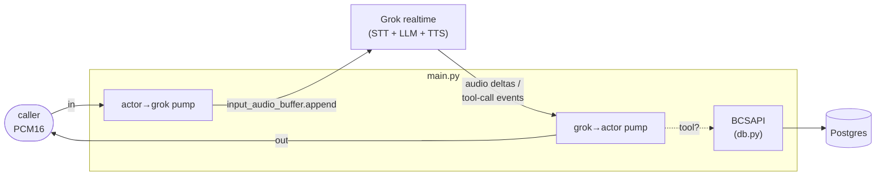

# app

The Python package for Riley. Four modules: the FastAPI bridge that *is* the
agent process, the realtime tool schemas + dispatcher, the Postgres-backed
card-ops layer the tools call, and a small Veris reporting shim. Container
startup and how to run a simulation live in the
[top-level README](../README.md); this doc is about the code.

| Module | Role |
|--------|------|
| `main.py` | The whole agent process. A FastAPI app exposing `WS /voice` (and `/health`); each connection opens its own Grok realtime session (instructions from `agent_desc.txt`, the five tools, `server_vad` endpointing), greets first, and runs two pumps — caller audio → Grok, Grok events → caller audio + tool dispatch. |
| `tools.py` | Wire-format tool schemas for the realtime session's `tools` array, and `dispatch()`, which maps a realtime function call to the corresponding `BCSAPI` method. |
| `reporting.py` | Veris integration shim. `report_tool_call` fire-and-forgets each tool call to the sandbox engine so it lands in the graded trace; a no-op outside a simulation. |
| `db.py` | The card-ops schema (pydantic models + enums), a psycopg2 `Database` wrapper, and `BCSAPI`, the validated facade the tools go through. See also [`db/README.md`](../db/README.md) for the data itself. |

`__init__.py` is empty — this is a plain namespace package, run as
`uvicorn app.main:app`.

## How one call flows through the package

1. A caller opens `WS /voice`. `main.py` connects to Grok realtime, sends
   `session.update` (prompt, tools, VAD, input transcription), then
   `response.create` so Riley greets first.
2. The caller's 20 ms PCM16 frames are base64-appended to Grok's input
   buffer; Grok's `server_vad` (800 ms silence) decides when a turn ends and
   auto-creates the response.
3. A `response.function_call_arguments.done` event is dispatched through
   `tools.py` → `BCSAPI` (validation) → `Database` (SQL) → Postgres; the
   result goes back as a `function_call_output` item and a follow-up
   `response.create` continues the turn.
4. Reply audio streams back to the caller delta-by-delta.

## The five tools

Each entry in `TOOLS` maps through `dispatch()` to one `BCSAPI` method:

| Tool | `BCSAPI` method | Notes |
|------|-----------------|-------|
| `display_user_info` | `get_user_info` | read-only lookup |
| `display_card_info_by_last4` | `find_card_by_last4` | read-only; attaches any in-flight replacement |
| `change_card_status` | `update_card_status` | a cancelled card can't be changed |
| `request_card_replacement` | `request_card_replacement` | cancels the old card, issues a new one, records a `replacement` row |
| `update_card_replacement_status` | `update_card_replacement_status` | advances requested → mailed → delivered |

Business rules live in `BCSAPI`, not the tools: cancelled cards can't be
re-statused or replaced. A rejected call raises `ValueError`, which `main.py`
catches and returns to the model as `{"error": ...}` so the LLM sees the
reason.

## Design notes worth knowing before you edit

- **Grok's wire protocol is OpenAI Realtime-compatible, with differences.**
  `voice`, `instructions`, and `turn_detection` sit at the session's top
  level in `session.update` (OpenAI nests them under `audio`). Input
  transcription events (`conversation.item.input_audio_transcription.*`)
  are only emitted when `audio.input.transcription.model` is set to
  `grok-transcribe` — without it, actor speech never shows up in agent.log.
  The input transcript is cumulative and may fire more than once per
  utterance as it refines.
- **Tools report themselves to the Veris engine.** The Grok session runs the
  LLM in xAI's cloud and executes the tools in-process here, so tool calls
  never reach the actor transcript and the grader can't see them.
  `report_tool_call` (in `reporting.py`) fire-and-forgets an `agent_tool_call`
  event to `ENGINE_URL` — on success *and* error paths — so completed actions
  land in the graded trace. It no-ops when `SIMULATION_ID` is unset, and runs
  the blocking POST in a worker thread so it never stalls the realtime loop.
- **Audio deltas stream straight through.** Every
  `response.output_audio.delta` is forwarded to the caller as it arrives — no
  whole-turn buffering — so response latency reflects the model, not this
  harness. (The openai-realtime-mini sibling buffers and dedupes extra items
  per response to work around an observed OpenAI double-emit bug; Grok hasn't
  shown that behavior, so this bridge stays simple.)
- **Tool calls don't end the turn.** After a tool's `function_call_output` is
  created, `main.py` sends another `response.create` on `response.done` so the
  model speaks the result instead of going silent.
- **`dispatch()` is `sync` and so is `BCSAPI`.** psycopg2 is synchronous; tool
  calls are infrequent enough that briefly blocking the loop on a quick query
  is fine. Don't make `db.py` async without a reason.
- **Endpointing is Grok's `server_vad`, pinned to 0.8 s** of silence;
  `threshold` and `prefix_padding_ms` stay on xAI's tuned defaults.

## Configuration

`main.py` reads `GROK_VOICE_MODEL`, `GROK_VOICE`, and `XAI_API_KEY`;
`db.py` reads `DATABASE_URL`; `reporting.py` reads `ENGINE_URL` and
`SIMULATION_ID`. The full table with defaults is in the
[top-level README](../README.md#environment).
