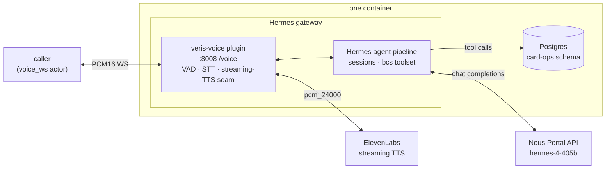

# riley-hermes

Riley, a card-support voice agent for Acme Bank, built on **[Hermes Agent](https://hermes-agent.nousresearch.com/)** — Nous Research's open-source, self-improving agent framework — with **[hermes-4-405b](https://portal.nousresearch.com/)** on Nous's own inference API as the LLM. Riley handles credit-card replacement and status-update calls end to end, backed by five Postgres tools. A single process runs the Hermes **gateway**; a custom platform-adapter plugin (`hermes_home/plugins/veris-voice/`) serves the `voice_ws` endpoint (raw PCM16 over a plain WebSocket) and bridges each call into Hermes's normal agent pipeline.

## What it does

One process runs inside the container (`python -m app.main` → the Hermes gateway):

- **`app/main.py`** — copies the checked-in `hermes_home/` template to a fresh temp dir, installs `agent_desc.txt` as `SOUL.md` (Hermes's per-deployment persona mechanism), and starts the gateway.
- **`hermes_home/plugins/veris-voice/adapter.py`** — the platform adapter. Per `/voice` connection: greets the caller, endpoints turns with an RMS VAD (800 ms of audio-time silence), transcribes each utterance through Hermes's STT stack (local faster-whisper, Hermes's default), and injects the transcript as a `MessageType.VOICE` message — the same entry point Hermes's Discord voice-channel loop uses. Replies come back through the gateway's **streaming-TTS contract**: Hermes's `StreamingTTSConsumer` chunks the live LLM delta stream into sentences, synthesises them via ElevenLabs (PCM16 at 24 kHz), and the adapter forwards the bytes straight onto the socket.
- The five tools (`display_user_info`, `display_card_info_by_last4`, `change_card_status`, `request_card_replacement`, `update_card_replacement_status`) are registered into a `bcs` toolset by the plugin and dispatched against `BCSAPI` (`app/db.py`), which talks to Postgres. `platform_toolsets` in `hermes_home/config.yaml` restricts the platform to exactly that toolset — the rest of Hermes's 60+ built-in tools stay off, matching the benchmark contract.



Unlike the hosted rows (Deepgram, Retell, Vapi) this is a self-hosted agent *framework* wearing a voice transport, and unlike the hand-rolled cascades (mistral, gradbot) the orchestration in the middle — session routing, tool loop, prompt assembly, sentence-chunked TTS streaming — is all Hermes's own machinery, not this repo's.

Things worth knowing about how Hermes Agent shapes the agent:

- **The transport is the one thing Hermes doesn't ship.** Hermes has live voice in its CLI and Discord voice channels but no audio API — a real-time voice mode was [closed as not planned](https://github.com/NousResearch/hermes-agent/issues/35750) and WebSocket mic streaming is an [open proposal](https://github.com/NousResearch/hermes-agent/issues/20765). The plugin supplies exactly that missing piece through two sanctioned seams: the platform-adapter plugin API, and the gateway's streaming-TTS adapter contract (`supports_streaming_tts` et al.) — which no bundled adapter implements yet. Everything between the socket and the model is stock Hermes.
- **The greeting is spoken without an LLM turn**, synthesized by the adapter at connect time, so nothing here contradicts the shared prompt's "you have already greeted the caller". No prompt override, unlike `grok-voice` and `gradbot`.
- **TTS is ElevenLabs by config, not Hermes's default (Edge TTS).** Only chunked streaming providers activate Hermes's sentence-by-sentence `StreamingTTSConsumer`; Edge has no chunked API, so with it every reply would be whole-turn audio delivered after the LLM finishes. ElevenLabs is the streaming path's reference implementation in Hermes's own source and emits the actor's exact wire format. This is a config.yaml knob (`tts.provider`), not a code change.
- **The LLM is Nous's flagship on Nous's backend.** Hermes's out-of-the-box default is OpenRouter fronting a third-party model, which would make this row a benchmark of someone else's LLM. `model.provider: nous-api` with `hermes-4-405b` keeps the row honestly "Nous stack".
- **Endpointing is the repo's 800 ms audio-time convention**, not Hermes's Discord heuristic (1.5 s of RTP packet silence, no VAD). The 0.5 s minimum-utterance guard mirrors Hermes's own `MIN_SPEECH_DURATION`. Barge-in cuts reply audio at the adapter and flags the interruption through Hermes's `mark_speech_interrupted()` note, so the next turn knows it was cut off; the in-flight LLM turn itself is handled by the gateway's busy-session interrupt.
- **Every boot is a cold start.** Hermes persists sessions, long-term memory, and learned skills under `HERMES_HOME`; `app/main.py` rebuilds that home from the template per process, so no state leaks between containers. Within one container, each call gets its own session, but Hermes's cross-session memory is real — calls in the same container share whatever it has learned.
- **Expect cascade-plus latency.** Each turn is batch STT (CPU whisper) → the full Hermes agent loop (prompt assembly, possible multi-step tool iterations) → sentence-streamed TTS. Hermes was built for messaging-first deployments, not telephony; that trade is the point of benchmarking it.

## Run a Veris simulation against it

Everything the simulator needs is in `.veris/`: a `voice_ws` actor channel pointed at `ws://localhost:8008/voice` and `Dockerfile.sandbox`. You need the `veris` CLI and an account — run `veris login` first. `curl` and `jq` are used for the API calls below.

Export your profile's values from `~/.veris/config.yaml` (written by `veris login`, under your active profile `profiles.<name>`):

```bash
export VERIS_URL=...    # backend_url
export VERIS_KEY=...    # api_key
export VERIS_ORG=...    # organization_id
```

**1. Create an environment.** This repo already ships a complete `.veris/`, so create a bare environment and drive everything by its id:

```bash
ENV_ID=$(curl -sS -X POST "$VERIS_URL/v1/environments" \
  -H "Authorization: Bearer $VERIS_KEY" -H "Content-Type: application/json" \
  -d "{\"name\":\"riley-hermes\",\"organization_id\":\"$VERIS_ORG\",\"skip_managed_onboarding\":true}" \
  | jq -r '.environment.id')
echo "$ENV_ID"
```

**2. Set the provider keys** (secret, one-time):

```bash
veris env vars set NOUS_API_KEY=...       --secret --env-id "$ENV_ID"
veris env vars set ELEVENLABS_API_KEY=... --secret --env-id "$ENV_ID"
```

**3. Push the environment:**

```bash
veris env push --env-id "$ENV_ID"
```

**4. Create scenarios and wait for them:**

```bash
veris scenarios create --env-id "$ENV_ID" --num 5
veris scenarios status --env-id "$ENV_ID" --watch
```

**5. Run:**

```bash
veris run --env-id "$ENV_ID" --scenario-set-id <set-id>
```

> [!NOTE]
> The first sandbox build is heavy: `uv sync` resolves the full hermes-agent
> dependency tree and the Dockerfile prefetches the faster-whisper `base`
> model into the image. Subsequent builds hit the layer cache.

## Run locally

```bash
uv sync
export DATABASE_URL=postgresql://localhost:5432/veris   # seeded from db/init.sql
export NOUS_API_KEY=...
export ELEVENLABS_API_KEY=...
uv run python -m app.main
```

Health check: `curl -s http://127.0.0.1:8008/health` → `{"status":"ok"}`.

> [!NOTE]
> Python is pinned to 3.12 (see `pyproject.toml`) — 3.13's strict X.509
> verification rejects the Veris sandbox's MITM CA, and 3.12 still ships
> `audioop`, which the adapter's VAD uses.

## Wire protocol (caller ↔ /voice)

| Property | Value |
| --- | --- |
| Sample rate | 24 000 Hz |
| Sample format | PCM16 (s16le), raw binary WS frames |
| Channels | 1 (mono) |
| Frame size | any (actor sends 20 ms / 960-byte frames) |
| End of call | either side closes the WebSocket |

No resampling happens anywhere on the audio path: ElevenLabs streams `pcm_24000` (the actor's exact format) and faster-whisper resamples the 24 kHz utterance WAVs internally.

## Environment

| Variable | Required | Default | Notes |
| --- | --- | --- | --- |
| `DATABASE_URL` | yes | (set by Veris) | Postgres DSN for the card-ops schema |
| `NOUS_API_KEY` | yes | — | Nous Portal key; `hermes-4-405b` chat completions |
| `ELEVENLABS_API_KEY` | yes | — | streaming TTS (`pcm_24000`) |
| `VERIS_VOICE_PORT` | no | `8008` | port for `/voice` + `/health` |

`HERMES_HOME`, the ephemeral gateway state directory, is created per boot by `app/main.py` — its path is logged at startup. Hermes-level behavior (model, toolsets, STT/TTS providers) is configured in `hermes_home/config.yaml`, not env vars.
