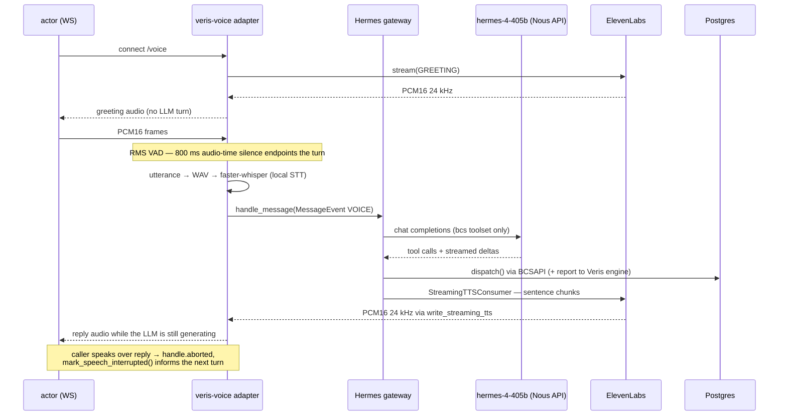

# app/ — launcher, tools, and data layer

The Hermes-specific transport lives outside this package (in
`hermes_home/plugins/veris-voice/adapter.py`, loaded by the Hermes plugin
system); `app/` holds the entry point and the pieces shared with every other
Riley implementation.

| Module | Role |
| --- | --- |
| `main.py` | Entry point (`python -m app.main`). Builds a fresh `HERMES_HOME` from the `hermes_home/` template, installs `agent_desc.txt` as `SOUL.md`, sets `GATEWAY_ALLOW_ALL_USERS` (the synthetic caller can't complete DM pairing), and runs `gateway.run.start_gateway()`. |
| `tools.py` | The five BCS tool schemas (bare `{name, description, parameters}` — exactly the shape Hermes's tool registry takes) and `dispatch()`, mapping calls to `BCSAPI`. |
| `db.py` | Pydantic models + `Database` (psycopg2) + `BCSAPI` facade with the business rules. Identical across implementations; connects via `DATABASE_URL`. |
| `reporting.py` | POSTs each tool call to the Veris engine as an `agent_tool_call` event so the grader sees in-process tool use. Runs from Hermes's synchronous agent worker thread, so it fires a daemon thread instead of an asyncio task. |

`__init__.py` is empty — this is a plain namespace package. There is no ASGI
app here: Hermes is a gateway process, and the `voice_ws` server (FastAPI on
:8008) is started *inside* the gateway by the veris-voice adapter, on the
gateway's own event loop.

## How one call flows through the process

1. **Connect.** Each WebSocket is one call: fresh `chat_id`, fresh Hermes
   session (`dm` scope), chat marked auto-TTS so the gateway builds the
   streaming-TTS consumer for its turns.
2. **Greeting.** Synthesized directly by the adapter — the shared prompt's
   "you have already greeted the caller" premise stays true, no override.
3. **Caller turn.** Frames are gated by RMS (threshold 500) with a 300 ms
   pre-roll so the first phoneme isn't clipped; 800 ms of silent audio ends
   the turn; utterances under 0.5 s are dropped (Hermes's own Discord-VC
   guard). The WAV goes through `tools.transcription_tools.transcribe_audio`
   and Hermes's whisper-hallucination filter before reaching the gateway.
4. **Agent turn.** Stock Hermes: session store, system prompt assembled from
   `SOUL.md`, the `bcs` toolset resolved via `platform_toolsets`, tool calls
   dispatched in-process against Postgres and reported to the Veris engine.
5. **Reply.** The gateway's `StreamingTTSConsumer` feeds LLM deltas through a
   sentence chunker into ElevenLabs and pushes PCM to the adapter's
   `write_streaming_tts` — audio starts before the model finishes. On
   barge-in the adapter flags the handle aborted (late chunks are dropped,
   per the contract) and raises Hermes's speech-interrupted note.

## Design notes worth knowing before you edit

- `supports_streaming_tts` **raises** on any format other than PCM16 mono
  24 kHz rather than resampling — the actor protocol is fixed, and a
  misconfigured TTS provider should fail loudly, not degrade.
- `play_tts` (the gateway's whole-file fallback) is overridden to fail: there
  is no whole-file audio path to the actor, and silently swallowing a failed
  streaming turn would grade as a mysterious dead call.
- The uvicorn server shares the gateway's event loop by construction — the
  streaming-TTS consumer writes to call WebSockets from that loop, and
  asyncio objects are loop-bound. Don't move the server to a thread.
- uvicorn's `serve()` installs its own SIGINT/SIGTERM handlers over the
  gateway's; in the sandbox the container is simply killed, so nothing is
  lost, but a long-lived local deployment would want that reconciled.
