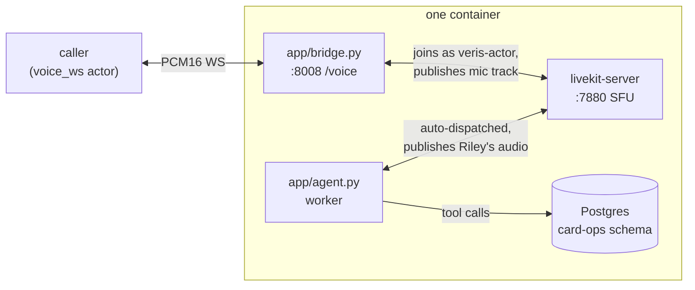

# riley-livekit

Riley, a card-support voice agent for Acme Bank, built on [LiveKit Agents](https://docs.livekit.io/agents/) with a **cascaded pipeline — Deepgram STT, an OpenAI `gpt-4.1-mini` chat LLM, and ElevenLabs TTS**. Riley runs as a LiveKit `AgentServer` worker inside a LiveKit room and handles credit-card replacement and status-update calls end to end, backed by five Postgres tools. A small in-container bridge translates a `voice_ws` channel (raw PCM16 over a plain WebSocket) into the room.

LiveKit is WebRTC end-to-end, so it cannot speak `voice_ws` directly. This repo includes a thin bridge process that translates transports while passing the audio bytes through unchanged — no changes are needed outside this repo.

## What it does

Three processes run inside one container (launched by `start.sh`):

1. **`livekit-server`** — the SFU, on `localhost:7880` (dev mode, `devkey`/`secret`).
2. **`app/agent.py`** — the LiveKit Agents worker. `RileyAgent` runs a cascaded `AgentSession` (Deepgram STT → OpenAI `gpt-4.1-mini` → ElevenLabs TTS, with Silero VAD), greets first, and exposes the five card-ops tools (`display_user_info`, `display_card_info_by_last4`, `change_card_status`, `request_card_replacement`, `update_card_replacement_status`). The worker auto-dispatches into every room.
3. **`app/bridge.py`** — a FastAPI `voice_ws` bridge at `WS /voice` (plus `/health`). Each `/voice` connection spins up a room `veris-<rand>`, joins as `veris-actor`, publishes the caller's PCM16 as a mic track, and forwards the agent's audio back — re-sliced from LiveKit's 10 ms frames to the caller's 20 ms frames.



## Why a bridge (and why the startup order matters)

The agent worker can only be dispatched into a room that already exists, and the room is created when a caller opens `/voice`. If the worker hasn't registered with the SFU yet, the bridge waits for an agent track that never comes (the "agent never subscribed within 30s" race). `start.sh` fixes this: start the SFU → wait for `:7880` → start the worker → let it register → only then bring up the bridge. By the time a call arrives, the worker is already registered, so dispatch is near-instant.

## Run a Veris simulation against it

Everything the simulator needs is in `.veris/`: a `voice_ws` actor channel pointed at the bridge (`ws://localhost:8008/voice`) and `Dockerfile.sandbox`. You need the `veris` CLI and an account — run `veris login` first. `curl` and `jq` are used for the two API calls below.

Export your profile's values from `~/.veris/config.yaml` (written by `veris login`, under your active profile `profiles.<name>`):

```bash
export VERIS_URL=...    # backend_url
export VERIS_KEY=...    # api_key
export VERIS_ORG=...    # organization_id
```

**1. Create an environment.** This repo already ships a complete `.veris/`, so create a bare environment and drive everything by its id:

```bash
ENV_ID=$(curl -sS -X POST "$VERIS_URL/v1/environments" \
  -H "Authorization: Bearer $VERIS_KEY" -H "Content-Type: application/json" \
  -d "{\"name\":\"riley-livekit\",\"organization_id\":\"$VERIS_ORG\",\"skip_managed_onboarding\":true}" \
  | jq -r '.environment.id')
echo "$ENV_ID"
```

**2. Set the provider keys** (secret, one-time):

```bash
veris env vars set OPENAI_API_KEY=sk-... DEEPGRAM_API_KEY=... ELEVENLABS_API_KEY=... \
  --secret --env-id "$ENV_ID"
```

**3. Build & push the image:**

```bash
veris env push --env-id "$ENV_ID"
```

This builds `.veris/Dockerfile.sandbox` — installs `livekit-server`, runs `uv sync --frozen` (needs the committed `uv.lock`), and copies `app/`, `agent_desc.txt`, `db/init.sql`, and `start.sh`.

**4. Generate a scenario set** (also creates the grader bound to the set):

```bash
veris scenarios create --num 5 --env-id "$ENV_ID"   # prints a scenset_… id
veris scenarios status <scenset_id> --watch         # wait for "ready"
```

**5. Run + grade:**

```bash
veris run --scenario-set-id <scenset_id> --env-id "$ENV_ID"
```

`veris run` simulates every scenario, grades it with the set's grader, and prints a report (pass `--grader-id` to pin one; list them with `veris scenarios list --env-id "$ENV_ID"`). The actor streams PCM16 from its own voice persona into `/voice`, and each call's recording lands at `/sessions/{session_id}/voice-recording.mp3`.

Runs execute up to 50 simulations in parallel by default. To run sequentially (or set any `N`), create the run through the API instead and poll it:

```bash
RUN_ID=$(curl -sS -X POST "$VERIS_URL/v1/runs" \
  -H "Authorization: Bearer $VERIS_KEY" -H "Content-Type: application/json" \
  -d "{\"scenario_set_id\":\"<scenset_id>\",\"environment_id\":\"$ENV_ID\",\"parallel_jobs\":1,\"auto_evaluate\":true}" \
  | jq -r '.id')
veris simulations status "$RUN_ID" --watch
```

## Wire protocol (caller ↔ /voice)

Binary WebSocket frames carrying raw PCM16 audio:

| Property      | Value                                 |
|---------------|---------------------------------------|
| Sample rate   | 24,000 Hz                             |
| Sample format | signed 16-bit little-endian (`s16le`) |
| Channels      | mono                                  |
| Frame size    | 20 ms (960 bytes) out; passthrough in |
| End of call   | either side closes the WS             |

LiveKit's audio track stays continuously live, so silence flows between turns naturally and the caller's VAD commits without an explicit silence pump.

## Environment

| Variable               | Required | Default                | Notes |
|------------------------|----------|------------------------|-------|
| `OPENAI_API_KEY`       | yes      | —                      | the `gpt-4.1-mini` chat LLM |
| `DEEPGRAM_API_KEY`     | yes      | —                      | Deepgram STT |
| `ELEVENLABS_API_KEY`   | yes      | —                      | ElevenLabs TTS (also accepts `ELEVEN_API_KEY`) |
| `DATABASE_URL`         | yes      | (set by Veris)         | Postgres for the card-ops tools |
| `LIVEKIT_URL`          | no       | `ws://localhost:7880`  | the in-container SFU |
| `LIVEKIT_API_KEY`      | no       | `devkey`               | dev-mode SFU key |
| `LIVEKIT_API_SECRET`   | no       | `secret`               | dev-mode SFU secret |
| `PORT`                 | no       | `8008`                 | voice_ws bridge port |
| `DEEPGRAM_MODEL`       | no       | `nova-3-general`       | STT model override |
| `LLM_MODEL`            | no       | `gpt-4.1-mini`         | chat LLM override |
| `ELEVENLABS_VOICE_ID`  | no       | `EXAVITQu4vr4xnSDxMaL` | ElevenLabs voice |
| `ELEVENLABS_TTS_MODEL` | no       | `eleven_flash_v2`      | ElevenLabs TTS model |
