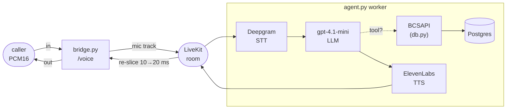

# app

The Python package for Riley. Four modules: the LiveKit worker that *is* the
agent, the WebSocket bridge that lets a `voice_ws` caller reach it, the
Postgres-backed card-ops layer its tools call, and a small Veris reporting shim.
The process topology, container startup, and how to run a simulation live in the
[top-level README](../README.md); this doc is about the code.

| Module | Role |
|--------|------|
| `agent.py` | The LiveKit Agents worker. `RileyAgent` + the cascaded `AgentSession` (Deepgram STT → `gpt-4.1-mini` → ElevenLabs TTS + Silero VAD), the five card-ops `@function_tool`s, and the `AgentServer` entrypoint that auto-dispatches into every room. |
| `reporting.py` | Veris integration shim. `report_tool_call` fire-and-forgets each tool call to the sandbox engine so it lands in the graded trace; a no-op outside a simulation. |
| `bridge.py` | A FastAPI app exposing `WS /voice` (and `/health`). Bridges the caller's raw PCM16 WebSocket into a LiveKit room so the worker can talk to it. No agent logic — pure transport. |
| `db.py` | The card-ops schema (pydantic models + enums), a psycopg2 `Database` wrapper, and `BCSAPI`, the validated facade the tools go through. See also [`db/README.md`](../db/README.md) for the data itself. |

`__init__.py` is empty — this is a plain namespace package, run as modules
(`python -m app.agent`, `uvicorn app.bridge:app`).

## How one call flows through the package

1. A caller opens `WS /voice`. `bridge.py` mints a token, spins up a room
   `veris-<rand>`, joins as `veris-actor`, and publishes the incoming audio as a
   mic track. The worker is auto-dispatched into that room.
2. `agent.py`'s `AgentSession` runs the cascade: Deepgram transcribes, the LLM
   (with `agent_desc.txt` as its system prompt) decides what to say and which
   tool to call, ElevenLabs speaks the reply.
3. A tool call lands on a `RileyAgent` method → `BCSAPI` (validation) →
   `Database` (SQL) → Postgres, and the result goes back to the LLM.
4. The reply audio is published to the room; `bridge.py` re-slices LiveKit's
   10 ms frames to the caller's 20 ms frames and sends them back.

## The five tools

Each `@function_tool` on `RileyAgent` is a thin wrapper over one `BCSAPI` method:

| Tool | `BCSAPI` method | Notes |
|------|-----------------|-------|
| `display_user_info` | `get_user_info` | read-only lookup |
| `display_card_info_by_last4` | `find_card_by_last4` | read-only; attaches any in-flight replacement |
| `change_card_status` | `update_card_status` | a cancelled card can't be changed |
| `request_card_replacement` | `request_card_replacement` | cancels the old card, issues a new one, records a `replacement` row |
| `update_card_replacement_status` | `update_card_replacement_status` | advances requested → mailed → delivered |

Business rules live in `BCSAPI`, not the tools: cancelled cards can't be
re-statused or replaced. A rejected call raises `ValueError` in the facade,
which the tool re-raises as `ToolError` so the LLM sees the reason.

## Design notes worth knowing before you edit

- **Tools report themselves to the Veris engine.** LiveKit tools run in-process
  on the worker and never reach the actor transcript, so the grader can't see
  them. `report_tool_call` (in `reporting.py`) fire-and-forgets an
  `agent_tool_call` event to `ENGINE_URL` so completed actions land in the
  graded trace. It no-ops when `SIMULATION_ID` is unset, and runs the blocking
  POST in a worker thread so it never stalls the realtime loop.
- **`AgentServer(load_fnc=lambda *_: 0.0)`.** A prod-mode worker's default
  CPU-based load function trips its 0.7 threshold when the SFU, worker, and
  bridge share one container under load — the SFU then reports "no workers with
  sufficient capacity" and the agent never joins. Pinning load to 0 disables the
  self-throttle for this single-call-per-container design.
- **Tool methods are `async` but `BCSAPI` is `sync`.** psycopg2 is synchronous;
  tool calls are infrequent enough that briefly blocking the loop on a quick
  query is fine. Don't make `db.py` async without a reason.
- **Endpointing is pure silence, pinned to 0.8 s.** No turn-detector plugin;
  the effective endpoint is `max(VAD silence, min_endpointing_delay)`, so both
  `min_endpointing_delay` and Silero's `min_silence_duration` are set to 0.8.
- **The bridge re-slices frames.** LiveKit emits 10 ms audio frames; the
  `voice_ws` actor expects 20 ms (960-byte) frames, so `_pump_room_to_actor`
  buffers and re-slices. Inbound frames are passed through as-is —
  `AudioSource` accepts variable-size frames.

## Configuration

Model and provider knobs are read from the environment in `agent.py`
(`LLM_MODEL`, `DEEPGRAM_MODEL`, `ELEVENLABS_VOICE_ID`, `ELEVENLABS_TTS_MODEL`,
plus the `*_API_KEY`s); `db.py` reads `DATABASE_URL`; `bridge.py` reads
`PORT` and the `LIVEKIT_*` vars; `reporting.py` reads `ENGINE_URL` and
`SIMULATION_ID`. The full table with defaults is in the
[top-level README](../README.md#environment).
