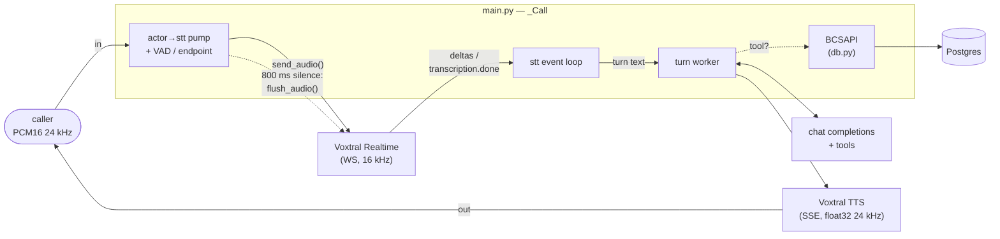

# app

The Python package for Riley. Four modules: the FastAPI app that *is* the
agent process and hosts the whole speech-to-speech pipeline, the tool schemas +
dispatcher, the Postgres-backed card-ops layer the tools call, and a small
Veris reporting shim. Container startup and how to run a simulation live in the
[top-level README](../README.md); this doc is about the code.

| Module | Role |
|--------|------|
| `main.py` | The whole agent process. A FastAPI app exposing `WS /voice` (and `/health`); each connection opens a Voxtral Realtime transcription session and runs the pipeline in `_Call` — VAD and endpointing on the caller's audio, a Mistral chat completion with the five tools, and Voxtral TTS for the reply. |
| `tools.py` | The five card-ops tools in Mistral's function-calling shape, and `dispatch()`, which maps a tool call to the corresponding `BCSAPI` method. |
| `reporting.py` | Veris integration shim. `report_tool_call` fire-and-forgets each tool call to the sandbox engine so it lands in the graded trace; a no-op outside a simulation. |
| `db.py` | The card-ops schema (pydantic models + enums), a psycopg2 `Database` wrapper, and `BCSAPI`, the validated facade the tools go through. See also [`db/README.md`](../db/README.md) for the data itself. |

`__init__.py` is empty — this is a plain namespace package, run as
`uvicorn app.main:app`.

## How one call flows through the package

1. A caller opens `WS /voice`. `main.py` connects to Voxtral Realtime, then the
   turn worker speaks the greeting so Riley opens the call.
2. Every inbound 20 ms frame is measured (`audioop.rms`) and downsampled 24 → 16
   kHz into the transcription session. The RMS is the VAD: it decides both
   barge-in and, after `END_OF_TURN_S` of silence *in audio time*, the endpoint.
3. At the endpoint the pump calls `flush_audio()`, and Voxtral answers with
   `transcription.done` carrying the finished turn text — including the last
   word or two the deltas were still holding back.
4. The turn worker appends the turn, calls `chat.complete_async` with the five
   tools, and loops while the model keeps calling them: each call goes through
   `tools.dispatch` → `BCSAPI` (validation) → `Database` (SQL) → Postgres, and
   comes back as a `tool` message.
5. The final text is streamed through Voxtral TTS, converted float32 → int16,
   and sent to the caller chunk by chunk. A voiced frame arriving mid-reply
   cancels that task — barge-in.

Turns are queued and handled one at a time, so the message list is only ever
touched by the worker even when the caller talks over a reply.
