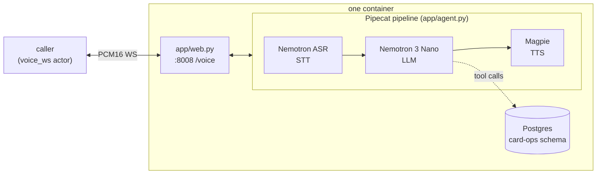

# riley-nemotron

Riley, a card-support voice agent for Acme Bank, built on [Pipecat](https://docs.pipecat.ai/) with an **end-to-end NVIDIA cascaded pipeline — Nemotron ASR Streaming, a Nemotron 3 Nano chat LLM, and Magpie TTS**. Every model is served from NVIDIA's hosted cloud API, authenticated by a single `NVIDIA_API_KEY` — no GPU, no self-hosting. Riley handles credit-card replacement and status-update calls end to end, backed by five Postgres tools. The pipeline terminates a `voice_ws` channel (raw PCM16 over a plain WebSocket) directly — no SFU, no WebRTC, no separate bridge process.

The stack mirrors NVIDIA's [nemotron-voice-agent blueprint](https://github.com/NVIDIA-AI-Blueprints/nemotron-voice-agent) cloud profile, using pipecat's stock `NvidiaSTTService` / `NvidiaLLMService` / `NvidiaTTSService`:

| Stage | Model | Endpoint |
|-------|-------|----------|
| STT | `nemotron-asr-streaming` | gRPC `grpc.nvcf.nvidia.com:443` (function `bb0837de-8c7b-481f-9ec8-ef5663e9c1fa`) |
| LLM | `nvidia/nemotron-3-nano-30b-a3b` | OpenAI-compatible `https://integrate.api.nvidia.com/v1` |
| TTS | `magpie-tts-multilingual`, voice `Magpie-Multilingual.EN-US.Aria` | gRPC `grpc.nvcf.nvidia.com:443` (function `877104f7-e885-42b9-8de8-f6e4c6303969`) |

## What it does

One process runs inside the container: uvicorn serving `app/web.py`, which exposes `WS /voice` (plus `/health`) on `:8008`. Each `/voice` connection gets its own Pipecat pipeline (`app/agent.py`):

```
transport.input() → Nemotron ASR → user_aggregator → Nemotron 3 Nano → Magpie TTS
→ transport.output() → assistant_aggregator
```

Riley greets first, then handles the call with the five card-ops tools (`display_user_info`, `display_card_info_by_last4`, `change_card_status`, `request_card_replacement`, `update_card_replacement_status`), all backed by Postgres through the `BCSAPI` facade.



## NVIDIA-cloud specifics worth knowing

- **One key, three services.** Get an `nvapi-...` key at [build.nvidia.com](https://build.nvidia.com/) (free Developer Program signup, 1,000 inference credits). The speech services authenticate over gRPC metadata (`function-id` + `authorization: Bearer`); the LLM is a plain OpenAI-compatible bearer token.
- **The hosted endpoints are trial-grade.** They are rate-limited (~40 requests/minute per key, HTTP 429 / gRPC errors beyond it) and credit-gated, with no SLA — fine for benchmark runs, not production. Run simulations with low parallelism (`parallel_jobs: 1-5`, see below) to stay under the ceiling; NVIDIA's production story is self-hosting the same models as NIM containers.
- **Magpie cold start is pre-warmed at boot.** The first request on a fresh channel to NVCF can take 10-20 s. `app/agent.py` runs one throwaway synthesis at import — before uvicorn binds `:8008` — so the pod's readiness probe absorbs the wait instead of the first call's greeting. If the prewarm log line shows a failure, the first call pays the cold start.
- **Magpie reserves `*`, `{`, `}`, and `<tag>`.** LLM output containing them garbles or breaks synthesis, so the TTS runs `NemotronSpeechTextFilter` (`app/text_filter.py`, from NVIDIA's blueprint) over every sentence.
- **Reasoning is disabled per-request.** Nemotron 3 is a hybrid-reasoning model; thinking tokens would delay the first spoken word by seconds. The LLM service sends `chat_template_kwargs: {enable_thinking: false}` (plus `repetition_penalty: 1.05`), the same settings NVIDIA's voice blueprint ships. Pipecat's `NvidiaLLMService` additionally strips any `reasoning_content` / `<think>` leakage so it is never spoken.
- **24 kHz end to end.** The Veris wire is PCM16/24 kHz; Riva ASR and TTS accept a declared `sample_rate_hz` and resample server-side, so the pipeline declares 24 kHz to both and no client-side resampling happens. (NVIDIA's blueprint runs the same services at 16 kHz — the rate is a request parameter, not a model constraint.)

## Run a Veris simulation against it

### Run as a benchmark image candidate

The benchmark runner launches an arbitrary image directly rather than through
the full simulation entrypoint. `Dockerfile.bench` packages the same Riley app
with a local, freshly seeded Postgres so no application changes are required:

```bash
docker build --platform linux/amd64 -f Dockerfile.bench -t <registry>/riley-nemotron:v1 .
docker push <registry>/riley-nemotron:v1
```

Import `.veris/veris.yaml` as a managed image candidate, set `image.path` to
`/voice` and `image.health_path` to `/health`, and add the provider keys listed
above as secret candidate environment entries. The benchmark engine stamps the
candidate's in-cluster address into the `voice_ws` channel.

Everything the simulator needs is in `.veris/`: a `voice_ws` actor channel pointed at `ws://localhost:8008/voice` and `Dockerfile.sandbox`. You need the `veris` CLI and an account — run `veris login` first. `curl` and `jq` are used for the API calls below.

Export your profile's values from `~/.veris/config.yaml` (written by `veris login`, under your active profile `profiles.<name>`):

```bash
export VERIS_URL=...    # backend_url
export VERIS_KEY=...    # api_key
export VERIS_ORG=...    # organization_id
```

**1. Create an environment.** This repo already ships a complete `.veris/`, so create a bare environment and drive everything by its id:

```bash
ENV_ID=$(curl -sS -X POST "$VERIS_URL/v1/environments" \
  -H "Authorization: Bearer $VERIS_KEY" -H "Content-Type: application/json" \
  -d "{\"name\":\"riley-nemotron\",\"organization_id\":\"$VERIS_ORG\",\"skip_managed_onboarding\":true}" \
  | jq -r '.environment.id')
echo "$ENV_ID"
```

**2. Set the provider key** (secret, one-time — one key covers STT, LLM, and TTS):

```bash
veris env vars set NVIDIA_API_KEY=nvapi-... --secret --env-id "$ENV_ID"
```

**3. Build & push the image:**

```bash
veris env push --env-id "$ENV_ID"
```

This builds `.veris/Dockerfile.sandbox` — runs `uv sync --frozen` (needs the committed `uv.lock`) and copies `app/`, `agent_desc.txt`, and `db/init.sql`.

**4. Generate a scenario set:**

```bash
veris scenarios create --num 5 --env-id "$ENV_ID"   # prints a scenset_… id
veris scenarios status <scenset_id> --watch         # wait for "ready"
```

Known bug (CLI ≤ 2.27.1): scenario generation silently skips the grader — the set still reports "ready", but `veris run` aborts with "No grader found". Regenerate just the grader step on the existing set:

```bash
curl -sS -X POST "$VERIS_URL/v1/scenario-sets/<scenset_id>/regenerate" \
  -H "Authorization: Bearer $VERIS_KEY" -H "Content-Type: application/json" \
  -d '{"from_step":"graders"}'
veris scenarios status <scenset_id> --watch         # back to "ready", grader now bound
```

**5. Run + grade.** `veris run` defaults to 50 parallel simulations — enough concurrent calls to trip NVIDIA's per-key rate limit (~40 requests/minute across all three services). Create the run through the API with low `parallel_jobs` instead and poll it:

```bash
RUN_ID=$(curl -sS -X POST "$VERIS_URL/v1/runs" \
  -H "Authorization: Bearer $VERIS_KEY" -H "Content-Type: application/json" \
  -d "{\"scenario_set_id\":\"<scenset_id>\",\"environment_id\":\"$ENV_ID\",\"parallel_jobs\":1,\"auto_evaluate\":true}" \
  | jq -r '.id')
veris simulations status "$RUN_ID" --watch
```

Each scenario is simulated and graded with the set's grader. The actor streams PCM16 from its own voice persona into `/voice`, and each call's recording lands at `/sessions/{session_id}/voice-recording.mp3`.

## Wire protocol (caller ↔ /voice)

Binary WebSocket frames carrying raw PCM16 audio:

| Property      | Value                                 |
|---------------|---------------------------------------|
| Sample rate   | 24,000 Hz                             |
| Sample format | signed 16-bit little-endian (`s16le`) |
| Channels      | mono                                  |
| Frame size    | passthrough in both directions        |
| End of call   | either side closes the WS             |

## Environment

| Variable           | Required | Default                          | Notes |
|--------------------|----------|----------------------------------|-------|
| `NVIDIA_API_KEY`   | yes      | —                                | one `nvapi-...` key for STT + LLM + TTS ([build.nvidia.com](https://build.nvidia.com/)) |
| `DATABASE_URL`     | yes      | (set by Veris)                   | Postgres for the card-ops tools |
| `LLM_MODEL`        | no       | `nvidia/nemotron-3-nano-30b-a3b` | any model on `integrate.api.nvidia.com` (e.g. `nvidia/nemotron-3-super-120b-a12b`) |
| `NVIDIA_TTS_VOICE` | no       | `Magpie-Multilingual.EN-US.Aria` | Magpie voice (`Model.Language.VoiceName`) |

The ASR and TTS function ids are pinned as constants in `app/agent.py` (`NEMOTRON_ASR`, `MAGPIE_TTS`) — swapping to e.g. Parakeet is a one-line change there, not an env var.
