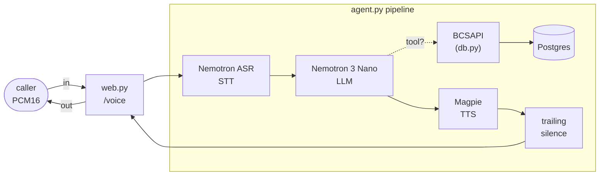

# app

The Python package for Riley. Seven modules: the Pipecat pipeline that *is* the
agent, the FastAPI server that terminates the `voice_ws` WebSocket, the
Postgres-backed card-ops layer its tools call, a Veris reporting shim, and three
small transport/TTS helpers. The container startup and how to run a simulation
live in the [top-level README](../README.md); this doc is about the code.

| Module | Role |
|--------|------|
| `agent.py` | The Pipecat pipeline. Nemotron ASR Streaming → Nemotron 3 Nano → Magpie TTS with Silero VAD turn-taking, the NVCF model constants and boot-time TTS prewarm, the five card-ops tool handlers, and `run_voice_ws_bot`, the per-connection entry point. |
| `web.py` | A FastAPI app exposing `WS /voice` (and `/health`) on `:8008`. Hands each accepted WebSocket to `run_voice_ws_bot`. No agent logic — pure transport. |
| `reporting.py` | Veris integration shim. `report_tool_call` fire-and-forgets each tool call to the sandbox engine so it lands in the graded trace; a no-op outside a simulation. |
| `serializers.py` | `RawPCM16Serializer` — the trivial bytes ↔ frame mapping for the raw PCM16/24 kHz `voice_ws` wire protocol. |
| `text_filter.py` | `NemotronSpeechTextFilter` (from NVIDIA's blueprint) — strips `*`, `{`, `}`, `<tag>` from TTS input; Magpie's preprocessor reserves them. |
| `db.py` | The card-ops schema (pydantic models + enums), a psycopg2 `Database` wrapper, and `BCSAPI`, the validated facade the tools go through. See also [`db/README.md`](../db/README.md) for the data itself. |

`__init__.py` is empty — this is a plain namespace package, run as
`uvicorn app.web:app`.

## How one call flows through the package

1. A caller opens `WS /voice`. `web.py` accepts it and `run_voice_ws_bot` wraps
   it in a `FastAPIWebsocketTransport` with `RawPCM16Serializer`, then builds a
   fresh pipeline for the call. Riley speaks a fixed greeting on connect.
2. Nemotron ASR transcribes, the LLM (with `agent_desc.txt` as its system
   prompt) decides what to say and which tool to call, Magpie speaks the reply.
3. A tool call lands on a handler → `BCSAPI` (validation) → `Database` (SQL) →
   Postgres, and the result goes back to the LLM via `result_callback`.
4. The reply audio flows out through `transport.output()` to the caller.

## The five tools

Each handler is a thin wrapper over one `BCSAPI` method:

| Tool | `BCSAPI` method | Notes |
|------|-----------------|-------|
| `display_user_info` | `get_user_info` | read-only lookup |
| `display_card_info_by_last4` | `find_card_by_last4` | read-only; attaches any in-flight replacement |
| `change_card_status` | `update_card_status` | a cancelled card can't be changed |
| `request_card_replacement` | `request_card_replacement` | cancels the old card, issues a new one, records a `replacement` row |
| `update_card_replacement_status` | `update_card_replacement_status` | advances requested → mailed → delivered |

Business rules live in `BCSAPI`, not the tools: cancelled cards can't be
re-statused or replaced. A rejected call raises `ValueError` in the facade,
which the handler returns to the LLM as `{"error": "..."}` — Pipecat has no
LiveKit-style `ToolError` channel, so the error is the tool result.

## Design notes worth knowing before you edit

- **Tools report themselves to the Veris engine.** Pipecat tools run in-process
  on the pipeline and never reach the actor transcript, so the grader can't see
  them. `report_tool_call` (in `reporting.py`) fire-and-forgets an
  `agent_tool_call` event to `ENGINE_URL` so completed actions land in the
  graded trace — on error paths too. It no-ops when `SIMULATION_ID` is unset,
  and runs the blocking POST in a worker thread so it never stalls the realtime
  loop.
- **Silero VAD is built once at import.** Building it per-connection cold-loads
  the ONNX session (~4 s warm, 25 s+ under cluster load), which loses to the
  actor's 10 s connect timeout. Only the lightweight per-call turn-strategy
  wrappers are fresh.
- **Magpie TTS is pre-warmed once at import.** The first request on a fresh
  channel to NVCF can take 10-20 s; `_prewarm_magpie_tts` runs one throwaway
  synthesis at boot so the readiness probe absorbs the wait, not the first
  call's greeting. Best-effort and deadline-bounded (60 s) — a failed or
  timed-out prewarm only shifts the cold start back onto the first call,
  and a stalled NVCF stream can't hang boot.
- **User turns start on VAD and FINAL transcripts only.** Pipecat's default also
  lets interim transcripts start a turn; each turn-start broadcasts an
  interruption that cancels the in-flight reply, and interim churn stalled
  ~30-50% of riley-pipecat's calls that way. Nemotron ASR streams interims too
  (`interim_results` defaults on), so `use_interim=False` keeps the soft-speech
  fallback without the churn.
- **Endpointing is pure silence, ~0.8 s effective.** 0.2 s Silero `stop_secs` +
  0.6 s `user_speech_timeout` — the same silence-timer endpointing as
  riley-pipecat and riley-livekit, no learned endpointer. Nemotron ASR has no
  measured TTFS in pipecat (conservative 1.0 s default), so the STT safety net
  is max(0, 1.0 − 0.2) = 0.8 s from VAD stop and a turn can stretch to ~1.0 s
  after speech end when a final transcript is late; Riva finalizes after
  ~320 ms of silence, so finals normally arrive in time and the safety net
  short-circuits.
- **Tool handlers are `async` but `BCSAPI` is `sync`.** psycopg2 is synchronous;
  tool calls are infrequent enough that briefly blocking the loop on a quick
  query is fine. Don't make `db.py` async without a reason.

## Configuration

Model and provider knobs are read from the environment in `agent.py`
(`NVIDIA_API_KEY`, `LLM_MODEL`, `NVIDIA_TTS_VOICE`); the ASR/TTS function ids
are constants there (`NEMOTRON_ASR`, `MAGPIE_TTS`). `db.py` reads
`DATABASE_URL`; `reporting.py` reads `ENGINE_URL` and `SIMULATION_ID`. The full
table with defaults is in the [top-level README](../README.md#environment).
