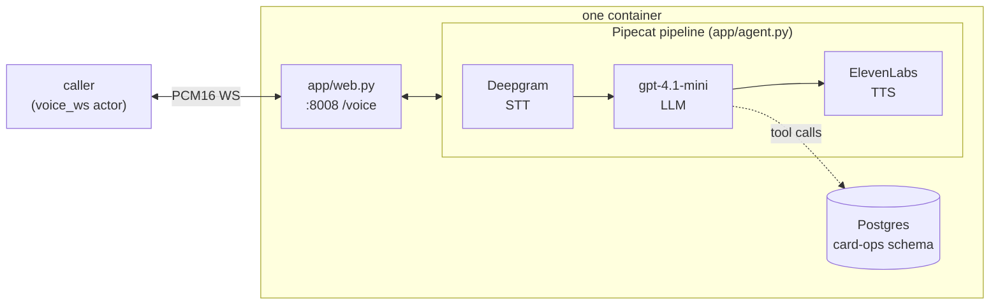

# riley-pipecat

Riley, a card-support voice agent for Acme Bank, built on [Pipecat](https://docs.pipecat.ai/) with a **cascaded pipeline — Deepgram STT, an OpenAI `gpt-4.1-mini` chat LLM, and ElevenLabs TTS**. Riley handles credit-card replacement and status-update calls end to end, backed by five Postgres tools. The pipeline terminates a `voice_ws` channel (raw PCM16 over a plain WebSocket) directly — no SFU, no WebRTC, no separate bridge process.

## What it does

One process runs inside the container: uvicorn serving `app/web.py`, which exposes `WS /voice` (plus `/health`) on `:8008`. Each `/voice` connection gets its own Pipecat pipeline (`app/agent.py`):

```
transport.input() → Deepgram STT → user_aggregator → gpt-4.1-mini → ElevenLabs TTS
→ transport.output() → assistant_aggregator
```

Riley greets first, then handles the call with the five card-ops tools (`display_user_info`, `display_card_info_by_last4`, `change_card_status`, `request_card_replacement`, `update_card_replacement_status`), all backed by Postgres through the `BCSAPI` facade.



## Run a Veris simulation against it

Everything the simulator needs is in `.veris/`: a `voice_ws` actor channel pointed at `ws://localhost:8008/voice` and `Dockerfile.sandbox`. You need the `veris` CLI and an account — run `veris login` first. `curl` and `jq` are used for the API calls below.

Export your profile's values from `~/.veris/config.yaml` (written by `veris login`, under your active profile `profiles.<name>`):

```bash
export VERIS_URL=...    # backend_url
export VERIS_KEY=...    # api_key
export VERIS_ORG=...    # organization_id
```

**1. Create an environment.** This repo already ships a complete `.veris/`, so create a bare environment and drive everything by its id:

```bash
ENV_ID=$(curl -sS -X POST "$VERIS_URL/v1/environments" \
  -H "Authorization: Bearer $VERIS_KEY" -H "Content-Type: application/json" \
  -d "{\"name\":\"riley-pipecat\",\"organization_id\":\"$VERIS_ORG\",\"skip_managed_onboarding\":true}" \
  | jq -r '.environment.id')
echo "$ENV_ID"
```

**2. Set the provider keys** (secret, one-time):

```bash
veris env vars set OPENAI_API_KEY=sk-... DEEPGRAM_API_KEY=... ELEVENLABS_API_KEY=... \
  --secret --env-id "$ENV_ID"
```

**3. Build & push the image:**

```bash
veris env push --env-id "$ENV_ID"
```

This builds `.veris/Dockerfile.sandbox` — runs `uv sync --frozen` (needs the committed `uv.lock`) and copies `app/`, `agent_desc.txt`, and `db/init.sql`.

**4. Generate a scenario set:**

```bash
veris scenarios create --num 5 --env-id "$ENV_ID"   # prints a scenset_… id
veris scenarios status <scenset_id> --watch         # wait for "ready"
```

Known bug (CLI ≤ 2.27.1): scenario generation silently skips the grader — the set still reports "ready", but `veris run` aborts with "No grader found". Regenerate just the grader step on the existing set:

```bash
curl -sS -X POST "$VERIS_URL/v1/scenario-sets/<scenset_id>/regenerate" \
  -H "Authorization: Bearer $VERIS_KEY" -H "Content-Type: application/json" \
  -d '{"from_step":"graders"}'
veris scenarios status <scenset_id> --watch         # back to "ready", grader now bound
```

**5. Run + grade:**

```bash
veris run --scenario-set-id <scenset_id> --env-id "$ENV_ID"
```

`veris run` simulates every scenario, grades it with the set's grader, and prints a report. The actor streams PCM16 from its own voice persona into `/voice`, and each call's recording lands at `/sessions/{session_id}/voice-recording.mp3`.

Runs execute up to 50 simulations in parallel by default. To run sequentially (or set any `N`), create the run through the API instead and poll it:

```bash
RUN_ID=$(curl -sS -X POST "$VERIS_URL/v1/runs" \
  -H "Authorization: Bearer $VERIS_KEY" -H "Content-Type: application/json" \
  -d "{\"scenario_set_id\":\"<scenset_id>\",\"environment_id\":\"$ENV_ID\",\"parallel_jobs\":1,\"auto_evaluate\":true}" \
  | jq -r '.id')
veris simulations status "$RUN_ID" --watch
```

## Wire protocol (caller ↔ /voice)

Binary WebSocket frames carrying raw PCM16 audio:

| Property      | Value                                 |
|---------------|---------------------------------------|
| Sample rate   | 24,000 Hz                             |
| Sample format | signed 16-bit little-endian (`s16le`) |
| Channels      | mono                                  |
| Frame size    | passthrough in both directions        |
| End of call   | either side closes the WS             |

## Environment

| Variable               | Required | Default                | Notes |
|------------------------|----------|------------------------|-------|
| `OPENAI_API_KEY`       | yes      | —                      | the `gpt-4.1-mini` chat LLM |
| `DEEPGRAM_API_KEY`     | yes      | —                      | Deepgram STT |
| `ELEVENLABS_API_KEY`   | yes      | —                      | ElevenLabs TTS |
| `DATABASE_URL`         | yes      | (set by Veris)         | Postgres for the card-ops tools |
| `LLM_MODEL`            | no       | `gpt-4.1-mini`         | chat LLM override |
| `DEEPGRAM_MODEL`       | no       | `nova-3-general`       | STT model override |
| `ELEVENLABS_VOICE_ID`  | no       | `EXAVITQu4vr4xnSDxMaL` | ElevenLabs voice |
| `ELEVENLABS_TTS_MODEL` | no       | `eleven_flash_v2`      | ElevenLabs TTS model |
