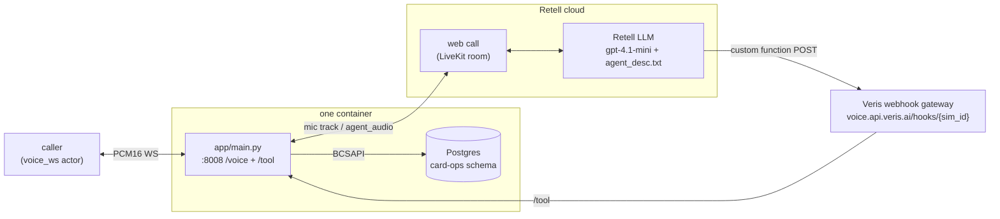

# riley-retell

Riley, a card-support voice agent for Acme Bank, built on [Retell AI](https://docs.retellai.com/) — a **managed Retell LLM (`gpt-4.1-mini`) + Retell agent pair (ElevenLabs `11labs-Adrian`, `eleven_flash_v2`)** that Retell runs in its cloud. Riley handles credit-card replacement and status-update calls end to end, backed by five Postgres tools served as Retell custom-function webhooks. A small in-container FastAPI app translates a `voice_ws` channel (raw PCM16 over a plain WebSocket) into the web call's LiveKit room.

Retell web calls are rooms on Retell's LiveKit Cloud, so this implementation bridges transports while passing the audio bytes through unchanged — no changes are needed outside this directory.

## What it does

One uvicorn process (`app/main.py`) serves three routes:

1. **`WS /voice`** — the `voice_ws` bridge. Each connection creates a Retell web call, joins its LiveKit room (`wss://retell-ai-4ihahnq7.livekit.cloud` — Retell's fixed platform-wide endpoint, hardcoded in the public `retell-client-js-sdk`) with the call's `access_token`, publishes the caller's PCM16 as a mic track, and forwards Riley's `agent_audio` track back.
2. **`POST /tool`** — the custom-function webhook. Retell cloud POSTs mid-call tool requests here; each is dispatched through `BCSAPI` to Postgres and reported to the Veris engine. When `RETELL_WEBHOOK_KEY` is set, `X-Retell-Signature` is verified.
3. **`GET /health`** — liveness.

Because Retell needs a publicly-reachable webhook URL, the Veris platform exposes the app through its shared webhook gateway (`agent.public_endpoint: true` in `.veris/veris.yaml`) and injects `PUBLIC_BASE_URL` — a unique `/hooks/{sim_id}` URL per simulation, so concurrent sims never share an endpoint. The first `/voice` connection provisions the Retell LLM (system prompt read verbatim from `agent_desc.txt`, five custom functions pointed at that URL's `/tool`) and the Retell agent, both deleted again on shutdown (or updated in place when `RETELL_LLM_ID`/`RETELL_AGENT_ID` pin an existing pair).



## Run a Veris simulation against it

Everything the simulator needs is in `.veris/`: a `voice_ws` actor channel pointed at the bridge (`ws://localhost:8008/voice`) and `Dockerfile.sandbox`. You need the `veris` CLI and an account — run `veris login` first. `curl` and `jq` are used for the two API calls below.

Export your profile's values from `~/.veris/config.yaml` (written by `veris login`, under your active profile `profiles.<name>`):

```bash
export VERIS_URL=...    # backend_url
export VERIS_KEY=...    # api_key
export VERIS_ORG=...    # organization_id
```

**1. Create an environment.** This directory already ships a complete `.veris/`, so create a bare environment and drive everything by its id:

```bash
ENV_ID=$(curl -sS -X POST "$VERIS_URL/v1/environments" \
  -H "Authorization: Bearer $VERIS_KEY" -H "Content-Type: application/json" \
  -d "{\"name\":\"riley-retell\",\"organization_id\":\"$VERIS_ORG\",\"skip_managed_onboarding\":true}" \
  | jq -r '.environment.id')
echo "$ENV_ID"
```

**2. Set the provider keys** (secret, one-time):

```bash
veris env vars set RETELL_API_KEY=... --secret --env-id "$ENV_ID"
# optional — enables /tool signature verification:
veris env vars set RETELL_WEBHOOK_KEY=... --secret --env-id "$ENV_ID"
```

**3. Build & push the image:**

```bash
veris env push --env-id "$ENV_ID"
```

This builds `.veris/Dockerfile.sandbox` — runs `uv sync --frozen` (needs the committed `uv.lock`) and copies `app/`, `agent_desc.txt`, and `db/init.sql`.

**4. Generate a scenario set** (also creates the grader bound to the set):

```bash
veris scenarios create --num 5 --env-id "$ENV_ID"   # prints a scenset_… id
veris scenarios status <scenset_id> --watch         # wait for "ready"
```

**5. Run + grade:**

```bash
veris run --scenario-set-id <scenset_id> --env-id "$ENV_ID"
```

`veris run` simulates every scenario, grades it with the set's grader, and prints a report (pass `--grader-id` to pin one; list them with `veris scenarios list --env-id "$ENV_ID"`). The actor streams PCM16 from its own voice persona into `/voice`, and each call's recording lands at `/sessions/{session_id}/voice-recording.mp3`.

Runs execute up to 50 simulations in parallel by default. To run sequentially (or set any `N`), create the run through the API instead and poll it:

```bash
RUN_ID=$(curl -sS -X POST "$VERIS_URL/v1/runs" \
  -H "Authorization: Bearer $VERIS_KEY" -H "Content-Type: application/json" \
  -d "{\"scenario_set_id\":\"<scenset_id>\",\"environment_id\":\"$ENV_ID\",\"parallel_jobs\":1,\"auto_evaluate\":true}" \
  | jq -r '.id')
veris simulations status "$RUN_ID" --watch
```

## Wire protocol (caller ↔ /voice)

Binary WebSocket frames carrying raw PCM16 audio:

| Property      | Value                                 |
|---------------|---------------------------------------|
| Sample rate   | 24,000 Hz                             |
| Sample format | signed 16-bit little-endian (`s16le`) |
| Channels      | mono                                  |
| Frame size    | passthrough both ways (LiveKit track frames out, actor frames in) |
| End of call   | either side closes the WS             |

Retell's `agent_audio` track emits frames continuously (comfort noise between turns, like a real phone line), so the caller's VAD sees an unbroken stream and commits turns on its own — no end-of-turn silence trailer is needed.

## Environment

| Variable             | Required | Default            | Notes |
|----------------------|----------|--------------------|-------|
| `RETELL_API_KEY`     | yes      | —                  | provisions the LLM/agent pair and creates web calls |
| `DATABASE_URL`       | yes      | (set by Veris)     | Postgres for the card-ops tools |
| `RETELL_WEBHOOK_KEY` | no       | —                  | when set, `/tool` verifies `X-Retell-Signature` |
| `PUBLIC_BASE_URL`    | yes      | (set by Veris)     | public webhook base URL, injected by the platform's webhook gateway |
| `RETELL_MODEL`       | no       | `gpt-4.1-mini`     | Retell LLM model |
| `RETELL_VOICE_ID`    | no       | `11labs-Adrian`    | Retell agent voice |
| `RETELL_VOICE_MODEL` | no       | `eleven_flash_v2`  | ElevenLabs TTS model behind the voice |
| `RETELL_LLM_ID`      | no       | —                  | reuse a persistent Retell LLM (local dev); updated in place each boot |
| `RETELL_AGENT_ID`    | no       | —                  | reuse a persistent Retell agent (local dev) |
