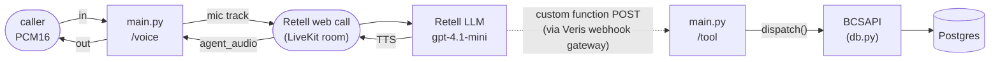

# app

The Python package for Riley. Four modules: the FastAPI app that bridges a
`voice_ws` caller into a Retell web call and serves Retell's tool webhooks, the
tool schemas + dispatcher, the Postgres-backed card-ops layer the tools call,
and a small Veris reporting shim. The container startup and how to run a
simulation live in the [top-level README](../README.md); this doc is about the
code.

| Module | Role |
|--------|------|
| `main.py` | The whole runtime. Provisions the Retell LLM + agent pair (system prompt read verbatim from `agent_desc.txt`, tool webhooks pointed at the platform-injected `PUBLIC_BASE_URL`), bridges each `WS /voice` connection into the web call's LiveKit room, and serves `POST /tool` for Retell's custom-function calls. |
| `tools.py` | The five card-ops tool schemas (`TOOL_FUNCTIONS`), `build_tools()` which wraps them as Retell custom functions pointing at `/tool`, and `dispatch()` which executes a call against `BCSAPI`. |
| `reporting.py` | Veris integration shim. `report_tool_call` fire-and-forgets each tool call to the sandbox engine so it lands in the graded trace; a no-op outside a simulation. |
| `db.py` | The card-ops schema (pydantic models + enums), a psycopg2 `Database` wrapper, and `BCSAPI`, the validated facade the tools go through. See also [`db/README.md`](../db/README.md) for the data itself. |

`__init__.py` is empty — this is a plain namespace package, run as
`uvicorn app.main:app`.

## How one call flows through the package

1. A caller opens `WS /voice`. On the first connection per boot, `main.py`
   provisions the Retell LLM (prompt from `agent_desc.txt`, tools from
   `build_tools()`) and agent; every connection then creates a web call and
   joins its LiveKit room, publishing the caller's audio as a mic track.
2. Retell runs the conversation in its cloud: STT, the LLM (with
   `agent_desc.txt` as its `general_prompt`), and ElevenLabs TTS.
3. A tool call becomes a `POST /tool` through the Veris webhook gateway →
   `dispatch()` → `BCSAPI` (validation) → `Database` (SQL) → Postgres, and the
   JSON result goes back to Retell in the webhook response.
4. Riley's reply audio arrives on the `agent_audio` track and is forwarded to
   the caller as-is.

## The five tools

Each `TOOL_FUNCTIONS` entry maps to one `BCSAPI` method in `dispatch()`:

| Tool | `BCSAPI` method | Notes |
|------|-----------------|-------|
| `display_user_info` | `get_user_info` | read-only lookup |
| `display_card_info_by_last4` | `find_card_by_last4` | read-only; attaches any in-flight replacement |
| `change_card_status` | `update_card_status` | a cancelled card can't be changed |
| `request_card_replacement` | `request_card_replacement` | cancels the old card, issues a new one, records a `replacement` row |
| `update_card_replacement_status` | `update_card_replacement_status` | advances requested → mailed → delivered |

Business rules live in `BCSAPI`, not the tools: cancelled cards can't be
re-statused or replaced. A rejected call raises `ValueError` in the facade,
which the webhook returns as a 2xx `{"error": ...}` payload the LLM voices.

## Design notes worth knowing before you edit

- **Tools report themselves to the Veris engine.** Retell executes tools as
  HTTP webhooks to `/tool`, so the calls never reach the actor transcript and
  the grader can't see them. `report_tool_call` (in `reporting.py`)
  fire-and-forgets an `agent_tool_call` event to `ENGINE_URL` — on success and
  on error paths — so completed actions land in the graded trace. It no-ops
  when `SIMULATION_ID` is unset.
- **Business-rule failures return 2xx.** Retell retries non-2xx webhook
  responses up to 2 times, and retrying a side-effecting tool like
  `request_card_replacement` must not happen. Errors come back as a 2xx
  `{"error": ...}` payload instead, which the LLM voices.
- **The tool webhook URL is platform-provided.** `agent.public_endpoint: true`
  in `.veris/veris.yaml` makes the Veris webhook gateway route a unique
  `/hooks/{sim_id}` URL to port 8008, injected as `PUBLIC_BASE_URL`. A missing
  value fails at import — there is no tunnel fallback.
- **Retell provisioning is lazy.** Deferred to the first `/voice` connection
  because it creates real cloud resources, which scenario generation — where
  the agent is only introspected — should not do.
- **Boot-created Retell resources are cleaned up.** The LLM + agent pair
  created on first `/voice` is deleted on shutdown so sim runs don't
  accumulate orphans in the Retell account. Pin `RETELL_LLM_ID` /
  `RETELL_AGENT_ID` to reuse a pair instead (it's updated in place, because
  the tool webhook URL is unique per simulation).
- **No silence pump.** Retell's `agent_audio` track streams continuously
  (comfort noise between turns), so the actor's VAD commits turns on its own.

## Configuration

Provider and voice knobs are read from the environment in `main.py`
(`RETELL_API_KEY`, `RETELL_WEBHOOK_KEY`, `RETELL_MODEL`, `RETELL_VOICE_ID`,
`RETELL_VOICE_MODEL`, `PUBLIC_BASE_URL`, plus the optional
`RETELL_LLM_ID`/`RETELL_AGENT_ID` pin); `db.py` reads `DATABASE_URL`;
`reporting.py` reads `ENGINE_URL` and `SIMULATION_ID`. The full table with
defaults is in the [top-level README](../README.md#environment).
